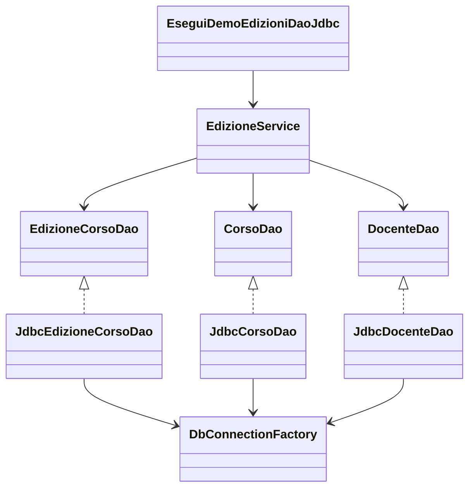

# 04 - LAB27 autonomo v2: gestione edizioni corso con DAO e CRUD JDBC

## Obiettivo

In questo laboratorio realizziamo una piccola applicazione Java Maven che gestisce le edizioni operative dei corsi usando DAO, JDBC e service applicativo.
L'applicazione deve essere completa di menu e, dove necessario suttomenu.

L'obiettivo principale è organizzare il codice in modo coerente, separando chiaramente:

- il modello dati;
- la configurazione della connessione;
- l'accesso al database;
- le regole applicative;
- la classe di avvio e dimostrazione.

In questa UD concludiamo la parte JDBC del percorso. Per questo motivo il laboratorio autonomo introduce un CRUD completo, ma solo sulla risorsa principale `EdizioneCorso`.

Le entità `Corso` e `Docente` vengono usate come anagrafiche di supporto. Su queste entità sono richieste solo operazioni di lettura.

---

## Collocazione nel percorso

Nel laboratorio guidato abbiamo visto come trasformare un accesso JDBC diretto in una struttura basata su DAO e service.

In questo laboratorio autonomo applichiamo lo stesso approccio a un caso più completo.

La progressione è questa:

```text
UD25
JDBC senza Maven: driver, classpath, Connection, PreparedStatement, ResultSet

UD26
Maven e JDBC: pom.xml, dipendenze, struttura progetto, configurazione

UD27
DAO e Service: interfacce, implementazioni JDBC, regole applicative, CRUD mirato
```

---

## Requisiti software

| Software/tool | Uso nel laboratorio |
|---|---|
| JDK 17 o superiore | Compilazione ed esecuzione Java |
| Maven | Build del progetto e gestione dipendenza JDBC |
| MariaDB/MySQL | Database applicativo |
| Client SQL | Esecuzione script e verifica dati |
| Terminale Windows PowerShell, Linux o macOS | Comandi Maven e avvio applicazione |
| Editor Java | Scrittura e modifica del codice |


Il database deve essere disponibile tramite installazione locale o tramite un server MariaDB/MySQL già predisposto.

---

## Scenario applicativo

L'academy deve gestire le edizioni operative dei corsi.

Un corso rappresenta l'offerta formativa, ad esempio:

```text
JAVA-BASE - Java Base
```

Un docente rappresenta una persona che può essere assegnata a una edizione.

Una edizione corso rappresenta una concreta erogazione di un corso, con data, docente e posti disponibili.

Esempio:

```text
ED-JAVA-BASE-2026-01
Corso: Java Base
Docente: Mario Rossi
Data inizio: 2026-06-10
Posti disponibili: 15
Attiva: sì
```

Dal punto di vista applicativo, la risorsa principale da gestire è `EdizioneCorso`.

---

## Scelta didattica del laboratorio

Il CRUD completo viene richiesto solo su `EdizioneCorso`.

| Entità | Ruolo nel laboratorio | Operazioni richieste |
|---|---|---|
| `Corso` | Anagrafica di riferimento | Lettura elenco e ricerca per id |
| `Docente` | Anagrafica di riferimento | Lettura elenco e ricerca per id |
| `EdizioneCorso` | Risorsa principale | Create, Read, Update, Delete |

Questa scelta evita di costruire tre CRUD completi nello stesso laboratorio, mantenendo però un caso realistico.

---

## Operazioni CRUD richieste

Sul DAO principale `EdizioneCorsoDao` devono essere implementate almeno queste operazioni.

| Operazione | Metodo suggerito | Significato |
|---|---|---|
| Create | `int insert(EdizioneCorso edizione)` | Crea una nuova edizione corso |
| Read | `List<EdizioneCorso> findAll()` | Legge tutte le edizioni |
| Read | `Optional<EdizioneCorso> findById(int id)` | Cerca una edizione per id |
| Update | `boolean decrementaPostiDisponibili(int id)` | Riduce di 1 i posti disponibili |
| Delete | `boolean deleteById(int id)` | Elimina una edizione per id |

La riduzione dei posti disponibili rappresenta l'operazione di aggiornamento del CRUD.

Non è richiesto un aggiornamento generico di tutti i campi dell'edizione. L'obiettivo è esercitarsi su una modifica applicativa semplice, ma significativa.

---

## Struttura del progetto

Creare un progetto Maven con questa struttura minima:

```text
UD27_gestione_edizioni_dao_jdbc/
  pom.xml
  sql/
    00_reset_database.sql
    01_schema.sql
    02_seed_data.sql
    03_queries_verifica.sql
  docs/
    evidence_UD27_autonomo.md
  src/
    main/
      java/
        corso/
          ud27/
            academy/
              app/
              config/
              model/
              dao/
              dao/
                jdbc/
              service/
```

Package richiesti:

```text
corso.ud27.academy.app
corso.ud27.academy.config
corso.ud27.academy.model
corso.ud27.academy.dao
corso.ud27.academy.dao.jdbc
corso.ud27.academy.service
```

La separazione dei package deve essere rispettata.

Non inserire query SQL nel `main` o nel service.

---

## Creazione cartelle

### Windows PowerShell

```powershell
New-Item -ItemType Directory -Force UD27_gestione_edizioni_dao_jdbc
Set-Location UD27_gestione_edizioni_dao_jdbc

New-Item -ItemType Directory -Force sql
New-Item -ItemType Directory -Force docs
New-Item -ItemType Directory -Force src/main/java/corso/ud27/academy/app
New-Item -ItemType Directory -Force src/main/java/corso/ud27/academy/config
New-Item -ItemType Directory -Force src/main/java/corso/ud27/academy/model
New-Item -ItemType Directory -Force src/main/java/corso/ud27/academy/dao
New-Item -ItemType Directory -Force src/main/java/corso/ud27/academy/dao/jdbc
New-Item -ItemType Directory -Force src/main/java/corso/ud27/academy/service
```

### Linux/macOS

```bash
mkdir -p UD27_gestione_edizioni_dao_jdbc
cd UD27_gestione_edizioni_dao_jdbc

mkdir -p sql docs
mkdir -p src/main/java/corso/ud27/academy/app
mkdir -p src/main/java/corso/ud27/academy/config
mkdir -p src/main/java/corso/ud27/academy/model
mkdir -p src/main/java/corso/ud27/academy/dao
mkdir -p src/main/java/corso/ud27/academy/dao/jdbc
mkdir -p src/main/java/corso/ud27/academy/service
```

---

## File `pom.xml`

Creare il file `pom.xml` nella radice del progetto.

Il file deve contenere:

- Java 17;
- dipendenza MariaDB Connector/J;
- plugin `exec-maven-plugin` per avviare la classe principale.

Schema da completare:

```xml
<project xmlns="http://maven.apache.org/POM/4.0.0"
         xmlns:xsi="http://www.w3.org/2001/XMLSchema-instance"
         xsi:schemaLocation="http://maven.apache.org/POM/4.0.0 https://maven.apache.org/xsd/maven-4.0.0.xsd">
    <modelVersion>4.0.0</modelVersion>

    <groupId>corso.ud27</groupId>
    <artifactId>gestione-edizioni-dao-jdbc</artifactId>
    <version>1.0.0</version>

    <properties>
        <maven.compiler.release>17</maven.compiler.release>
        <project.build.sourceEncoding>UTF-8</project.build.sourceEncoding>
    </properties>

    <dependencies>
        <!-- completare con la dipendenza del driver MariaDB -->
    </dependencies>

    <build>
        <plugins>
            <!-- configurare exec-maven-plugin -->
        </plugins>
    </build>
</project>
```

Suggerimento per la classe principale:

```text
corso.ud27.academy.app.EseguiDemoEdizioniDaoJdbc
```

---

## Script SQL richiesti

Preparare questi file nella cartella `sql/`:

```text
00_reset_database.sql
01_schema.sql
02_seed_data.sql
03_queries_verifica.sql
```

### `00_reset_database.sql`

```sql
DROP DATABASE IF EXISTS academy_ud27;
CREATE DATABASE academy_ud27
CHARACTER SET utf8mb4
COLLATE utf8mb4_unicode_ci;
```

### `01_schema.sql`

```sql
USE academy_ud27;

CREATE TABLE corsi (
    id INT PRIMARY KEY AUTO_INCREMENT,
    codice VARCHAR(30) NOT NULL UNIQUE,
    titolo VARCHAR(120) NOT NULL,
    durata_ore INT NOT NULL
);

CREATE TABLE docenti (
    id INT PRIMARY KEY AUTO_INCREMENT,
    nome VARCHAR(80) NOT NULL,
    cognome VARCHAR(80) NOT NULL,
    email VARCHAR(120) NOT NULL UNIQUE,
    area_competenza VARCHAR(80) NOT NULL
);

CREATE TABLE edizioni_corso (
    id INT PRIMARY KEY AUTO_INCREMENT,
    codice_edizione VARCHAR(40) NOT NULL UNIQUE,
    corso_id INT NOT NULL,
    docente_id INT NOT NULL,
    data_inizio DATE NOT NULL,
    posti_disponibili INT NOT NULL,
    attiva BOOLEAN NOT NULL DEFAULT TRUE,
    CONSTRAINT fk_edizioni_corso_corso
        FOREIGN KEY (corso_id) REFERENCES corsi(id),
    CONSTRAINT fk_edizioni_corso_docente
        FOREIGN KEY (docente_id) REFERENCES docenti(id)
);
```

### `02_seed_data.sql`

```sql
USE academy_ud27;

INSERT INTO corsi (codice, titolo, durata_ore) VALUES
('JAVA-BASE', 'Java Base', 40),
('JAVA-OOP', 'Java Object Oriented', 48),
('JDBC-DAO', 'JDBC e DAO', 32);

INSERT INTO docenti (nome, cognome, email, area_competenza) VALUES
('Mario', 'Rossi', 'mario.rossi@academy.local', 'Java'),
('Laura', 'Bianchi', 'laura.bianchi@academy.local', 'Database'),
('Anna', 'Verdi', 'anna.verdi@academy.local', 'Web');

INSERT INTO edizioni_corso (codice_edizione, corso_id, docente_id, data_inizio, posti_disponibili, attiva) VALUES
('ED-JAVA-BASE-01', 1, 1, '2026-06-10', 15, TRUE),
('ED-JAVA-OOP-01', 2, 1, '2026-06-20', 12, TRUE),
('ED-JDBC-DAO-01', 3, 2, '2026-07-01', 10, TRUE);
```

### `03_queries_verifica.sql`

```sql
USE academy_ud27;

SELECT * FROM corsi ORDER BY id;
SELECT * FROM docenti ORDER BY id;
SELECT * FROM edizioni_corso ORDER BY id;

SELECT e.id,
       e.codice_edizione,
       c.titolo AS corso,
       CONCAT(d.nome, ' ', d.cognome) AS docente,
       e.data_inizio,
       e.posti_disponibili,
       e.attiva
FROM edizioni_corso e
JOIN corsi c ON c.id = e.corso_id
JOIN docenti d ON d.id = e.docente_id
ORDER BY e.id;
```

---

## Esecuzione script SQL

Usare il client SQL preferito.

Se si usa il terminale, i comandi sono questi.

### Windows PowerShell

```powershell
Get-Content .\sql\00_reset_database.sql | mysql -u root -p
Get-Content .\sql\01_schema.sql | mysql -u root -p
Get-Content .\sql\02_seed_data.sql | mysql -u root -p
Get-Content .\sql\03_queries_verifica.sql | mysql -u root -p
```

### Linux/macOS

```bash
mysql -u root -p < sql/00_reset_database.sql
mysql -u root -p < sql/01_schema.sql
mysql -u root -p < sql/02_seed_data.sql
mysql -u root -p < sql/03_queries_verifica.sql
```

Se il comando `mysql` non è disponibile nel terminale, eseguire gli script da dbForge, MySQL Workbench, DBeaver o da un altro client SQL.

---

## Classi richieste

### Model

Creare almeno queste classi nel package `corso.ud27.academy.model`:

```text
Corso
Docente
EdizioneCorso
```

Campi minimi consigliati:

```text
Corso
- id
- codice
- titolo
- durataOre

Docente
- id
- nome
- cognome
- email
- areaCompetenza

EdizioneCorso
- id
- codiceEdizione
- corsoId
- docenteId
- dataInizio
- postiDisponibili
- attiva
```

Per `dataInizio` usare `java.time.LocalDate`.

---

## Configurazione

Creare nel package `corso.ud27.academy.config`:

```text
AppConfig
DbConnectionFactory
```

`AppConfig` deve leggere i parametri da variabili d'ambiente, con valori predefiniti adatti all'ambiente locale.

Di seguito una possibile soluzione; altrimenti procedere con informazioni recuperate da file esterno database.properties.

```java
public class AppConfig {
    public String getJdbcUrl() {
        return readEnv("UD27_JDBC_URL", "jdbc:mariadb://localhost:3306/academy_ud27");
    }

    public String getUsername() {
        return readEnv("UD27_DB_USER", "root");
    }

    public String getPassword() {
        return readEnv("UD27_DB_PASSWORD", "");
    }

    private String readEnv(String name, String defaultValue) {
        String value = System.getenv(name);
        if (value == null || value.isBlank()) {
            return defaultValue;
        }
        return value;
    }
}
```

`DbConnectionFactory` deve creare connessioni JDBC usando `DriverManager`.

Metodo atteso:

```java
public Connection openConnection() throws SQLException
```

---

## Variabili d'ambiente opzionali

Se il database usa credenziali diverse, impostare le variabili prima dell'esecuzione.

### Windows PowerShell

```powershell
$env:UD27_JDBC_URL="jdbc:mariadb://localhost:3306/academy_ud27"
$env:UD27_DB_USER="root"
$env:UD27_DB_PASSWORD="password"
```

### Linux/macOS

```bash
export UD27_JDBC_URL="jdbc:mariadb://localhost:3306/academy_ud27"
export UD27_DB_USER="root"
export UD27_DB_PASSWORD="password"
```

---

## DAO richiesti

Creare nel package `corso.ud27.academy.dao`:

```text
DaoException
CorsoDao
DocenteDao
EdizioneCorsoDao
```

Creare nel package `corso.ud27.academy.dao.jdbc`:

```text
JdbcCorsoDao
JdbcDocenteDao
JdbcEdizioneCorsoDao
```

---

## Metodi minimi dei DAO

### `CorsoDao`

```java
List<Corso> findAll();
Optional<Corso> findById(int id);
```

### `DocenteDao`

```java
List<Docente> findAll();
Optional<Docente> findById(int id);
```

### `EdizioneCorsoDao`

```java
List<EdizioneCorso> findAll();
Optional<EdizioneCorso> findById(int id);
int insert(EdizioneCorso edizione);
boolean decrementaPostiDisponibili(int id);
boolean deleteById(int id);
```

Questa è la parte CRUD del laboratorio.

Il CRUD completo è richiesto su `EdizioneCorso`, non su `Corso` e `Docente`.

---

## Regole tecniche per i DAO JDBC

Le implementazioni JDBC devono rispettare queste regole:

- usare `PreparedStatement`;
- usare `try-with-resources`;
- non concatenare valori utente dentro le query SQL;
- isolare il mapping da `ResultSet` a oggetto in metodi privati;
- trasformare `SQLException` in `DaoException`;
- non stampare output a video;
- non leggere input da tastiera;
- non applicare regole applicative complesse.

Il DAO deve occuparsi dell'accesso ai dati.

Il DAO non deve decidere se una operazione è valida dal punto di vista applicativo. Questa responsabilità appartiene al service.

---

## Suggerimenti per `JdbcEdizioneCorsoDao`

### Query di lettura

```sql
SELECT id, codice_edizione, corso_id, docente_id, data_inizio, posti_disponibili, attiva
FROM edizioni_corso
ORDER BY data_inizio, codice_edizione
```

### Query per ricerca per id

```sql
SELECT id, codice_edizione, corso_id, docente_id, data_inizio, posti_disponibili, attiva
FROM edizioni_corso
WHERE id = ?
```

### Query di inserimento

```sql
INSERT INTO edizioni_corso
(codice_edizione, corso_id, docente_id, data_inizio, posti_disponibili, attiva)
VALUES (?, ?, ?, ?, ?, ?)
```

Suggerimento: per recuperare l'id generato, usare:

```java
connection.prepareStatement(sql, Statement.RETURN_GENERATED_KEYS)
```

### Query di aggiornamento dei posti

```sql
UPDATE edizioni_corso
SET posti_disponibili = posti_disponibili - 1
WHERE id = ? AND posti_disponibili > 0 AND attiva = TRUE
```

Questa query evita di portare i posti sotto zero.

### Query di eliminazione

```sql
DELETE FROM edizioni_corso
WHERE id = ?
```

---

## Metodo `mapRow`

Nel DAO JDBC creare un metodo privato simile a questo:

```java
private EdizioneCorso mapRow(ResultSet rs) throws SQLException {
    // completare il mapping leggendo le colonne dal ResultSet
}
```

Il metodo `mapRow` deve trasformare una riga della tabella `edizioni_corso` in un oggetto `EdizioneCorso`.

Non deve aprire connessioni.
Non deve eseguire query.
Non deve stampare risultati.

Serve a evitare duplicazione del codice di mapping tra `findAll()` e `findById()`.

---

## Service richiesto

Creare nel package `corso.ud27.academy.service` la classe:

```text
EdizioneService
```

Il service deve ricevere le interfacce DAO tramite costruttore.

Esempio di struttura:

```java
public class EdizioneService {
    private final EdizioneCorsoDao edizioneCorsoDao;
    private final CorsoDao corsoDao;
    private final DocenteDao docenteDao;

    public EdizioneService(EdizioneCorsoDao edizioneCorsoDao,
                           CorsoDao corsoDao,
                           DocenteDao docenteDao) {
        this.edizioneCorsoDao = edizioneCorsoDao;
        this.corsoDao = corsoDao;
        this.docenteDao = docenteDao;
    }

    // completare i metodi applicativi
}
```

Il service deve dipendere da interfacce, non dalle classi JDBC concrete.

Corretto:

```java
private final EdizioneCorsoDao edizioneCorsoDao;
```

Da evitare:

```java
private final JdbcEdizioneCorsoDao edizioneCorsoDao;
```

---

## Regole applicative da mettere nel service

Il service deve contenere almeno questi controlli:

| Operazione | Controllo applicativo |
|---|---|
| Creazione edizione | Il corso deve esistere |
| Creazione edizione | Il docente deve esistere |
| Creazione edizione | I posti disponibili devono essere maggiori di zero |
| Creazione edizione | Il codice edizione non deve essere vuoto |
| Decremento posti | L'edizione deve esistere |
| Decremento posti | L'edizione deve avere posti disponibili |
| Eliminazione | L'edizione deve esistere |

Quando una regola non è rispettata, il service deve generare un errore applicativo chiaro, ad esempio con `IllegalArgumentException` o `IllegalStateException`.

Esempio:

```java
if (postiDisponibili <= 0) {
    throw new IllegalArgumentException("I posti disponibili devono essere maggiori di zero");
}
```

---

## Metodi suggeriti nel service

```java
List<Corso> elencoCorsi();
List<Docente> elencoDocenti();
List<EdizioneCorso> elencoEdizioni();
Optional<EdizioneCorso> cercaEdizione(int id);
int creaEdizione(EdizioneCorso edizione);
boolean prenotaPosto(int edizioneId);
boolean eliminaEdizione(int edizioneId);
```

Il metodo `prenotaPosto` può usare internamente `decrementaPostiDisponibili` del DAO.

In questo laboratorio non è necessario creare una vera gestione partecipanti. Il decremento dei posti serve solo a rappresentare un aggiornamento applicativo.

---

## Classe di avvio

Creare nel package `corso.ud27.academy.app`:

```text
EseguiDemoEdizioniDaoJdbc
```

La classe di avvio deve:

1. creare `AppConfig`;
2. creare `DbConnectionFactory`;
3. creare le implementazioni JDBC dei DAO;
4. creare `EdizioneService` passando le interfacce DAO;
5. stampare corsi e docenti;
6. stampare le edizioni iniziali;
7. creare una nuova edizione;
8. cercare la nuova edizione;
9. decrementare i posti disponibili;
10. eliminare una edizione di test;
11. stampare il riepilogo finale.

La classe di avvio può stampare i risultati.

La classe di avvio non deve contenere:

- query SQL;
- `Connection`;
- `PreparedStatement`;
- `ResultSet`;
- mapping da righe SQL a oggetti Java.

---

## Output minimo atteso

L'esecuzione deve produrre un output simile:

```text
=== Corsi disponibili ===
1 - JAVA-BASE - Java Base
2 - JAVA-OOP - Java Object Oriented
3 - JDBC-DAO - JDBC e DAO

=== Docenti disponibili ===
1 - Mario Rossi - Java
2 - Laura Bianchi - Database
3 - Anna Verdi - Web

=== Edizioni iniziali ===
...

Creazione nuova edizione: OK, id generato = 4
Ricerca nuova edizione: trovata
Prenotazione posto su edizione 4: OK
Eliminazione edizione di test: OK

=== Riepilogo finale ===
...
```

I valori effettivi possono essere diversi.

---

## Compilazione ed esecuzione

Da terminale, nella radice del progetto:

```bash
mvn clean package
mvn exec:java
```

Questi comandi sono uguali su Windows, Linux e macOS.

---

## Verifica diretta da SQL

Dopo l'esecuzione del programma, verificare i dati anche dal client SQL.

```sql
USE academy_ud27;

SELECT * FROM edizioni_corso ORDER BY id;

SELECT e.id,
       e.codice_edizione,
       c.titolo AS corso,
       CONCAT(d.nome, ' ', d.cognome) AS docente,
       e.data_inizio,
       e.posti_disponibili,
       e.attiva
FROM edizioni_corso e
JOIN corsi c ON c.id = e.corso_id
JOIN docenti d ON d.id = e.docente_id
ORDER BY e.id;
```

La verifica SQL serve a controllare che le operazioni eseguite da Java abbiano realmente modificato il database.

---

## Casi anomali da verificare

Oltre al caso corretto, verificare almeno tre casi anomali.

### Caso 1 - Creazione edizione con corso inesistente

Tentare di creare una edizione con `corsoId` non presente nella tabella `corsi`.

Risultato atteso:

```text
Il service blocca l'operazione prima dell'INSERT.
```

### Caso 2 - Creazione edizione con docente inesistente

Tentare di creare una edizione con `docenteId` non presente nella tabella `docenti`.

Risultato atteso:

```text
Il service blocca l'operazione prima dell'INSERT.
```

### Caso 3 - Prenotazione su edizione senza posti

Portare una edizione a `posti_disponibili = 0` oppure creare una edizione con pochi posti e provare a decrementare oltre il limite.

Risultato atteso:

```text
Il service o il DAO impedisce di portare i posti sotto zero.
```

### Caso 4 - Ricerca id inesistente

Cercare una edizione con id non presente.

Risultato atteso:

```text
Optional.empty()
```

---

## Suggerimenti in caso di difficoltà

### Se il progetto non compila

Controllare:

- dichiarazioni `package`;
- import mancanti;
- nomi delle classi;
- posizione dei file nella struttura Maven;
- configurazione del `pom.xml`.

### Se il programma compila ma non si collega al database

Controllare:

- database MariaDB/MySQL avviato;
- nome database `academy_ud27`;
- porta nell'URL JDBC;
- utente e password;
- variabili d'ambiente eventualmente impostate.

### Se una query non restituisce dati

Verificare prima la query nel client SQL.

Poi controllare:

- nome tabella;
- nome colonne;
- parametri impostati nel `PreparedStatement`;
- metodo `mapRow`.

### Se il decremento posti non funziona

Controllare la query:

```sql
UPDATE edizioni_corso
SET posti_disponibili = posti_disponibili - 1
WHERE id = ? AND posti_disponibili > 0 AND attiva = TRUE
```

Se `executeUpdate()` restituisce `0`, significa che nessuna riga è stata aggiornata.

Le cause possibili sono:

- id inesistente;
- edizione non attiva;
- posti disponibili già pari a zero.

---

## Evidence richiesta

Creare il file:

```text
docs/evidence_UD27_autonomo.md
```

Il file deve contenere:

1. struttura finale del progetto;
2. contenuto essenziale del `pom.xml`;
3. script SQL usati;
4. output di `mvn clean package`;
5. output di `mvn exec:java`;
6. schema delle classi o diagramma Mermaid;
7. spiegazione del ruolo di ogni package;
8. elenco dei metodi DAO implementati;
9. spiegazione di quali operazioni rappresentano Create, Read, Update e Delete;
10. output della verifica SQL finale;
11. descrizione dei casi anomali verificati;
12. risposte alle domande di controllo.

---

## Schema suggerito

Inserire nell'evidence uno schema simile utilizzando strumenti idoenei, adattandolo alla soluzione effettiva.



---

## Domande di controllo

Rispondere nel file evidence.

1. Perché `EdizioneService` deve dipendere da `EdizioneCorsoDao` e non da `JdbcEdizioneCorsoDao`?
2. Quale classe contiene le query SQL sulle edizioni?
3. Quale classe controlla che il corso associato a una edizione esista?
4. Quale classe controlla che il docente associato a una edizione esista?
5. Quale metodo rappresenta l'operazione Create del CRUD?
6. Quali metodi rappresentano le operazioni Read?
7. Quale metodo rappresenta l'operazione Update?
8. Quale metodo rappresenta l'operazione Delete?
9. Perché il DAO non deve stampare a video?
10. Perché il service non deve usare `PreparedStatement`?
11. Dove viene applicato il polimorfismo in questa soluzione?
12. Cosa cambierebbe se in futuro sostituissimo JDBC con JPA?
13. Perché `Optional<EdizioneCorso>` è utile nella ricerca per id?
14. Perché il mapping da `ResultSet` a oggetto deve stare nel DAO JDBC?

---

## Criteri di completamento

Il laboratorio è completo quando:

- il progetto Maven compila;
- gli script SQL sono eseguibili nell'ordine previsto;
- il programma si connette al database;
- `CorsoDao` e `DocenteDao` espongono operazioni di lettura;
- `EdizioneCorsoDao` implementa il CRUD richiesto;
- il service applica le regole applicative prima di chiamare i DAO;
- le implementazioni JDBC usano `PreparedStatement` e `try-with-resources`;
- il `main` non contiene SQL o codice JDBC diretto;
- la demo mostra creazione, lettura, aggiornamento e cancellazione di una edizione;
- l'evidence spiega le responsabilità dei livelli, non solo l'output prodotto.
