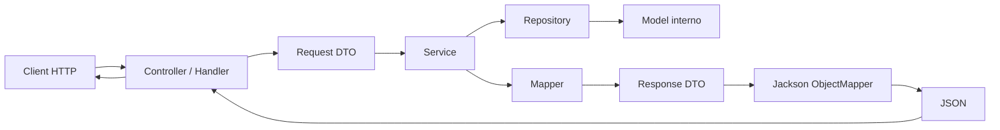
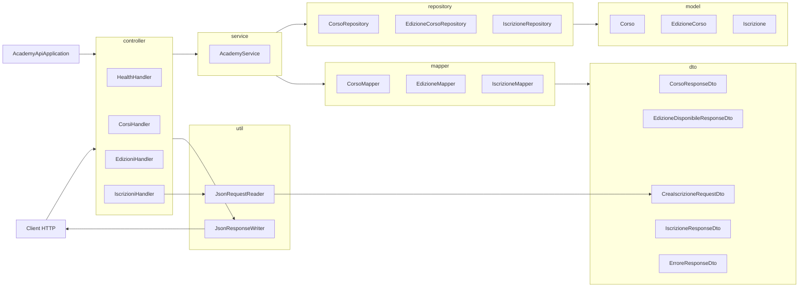
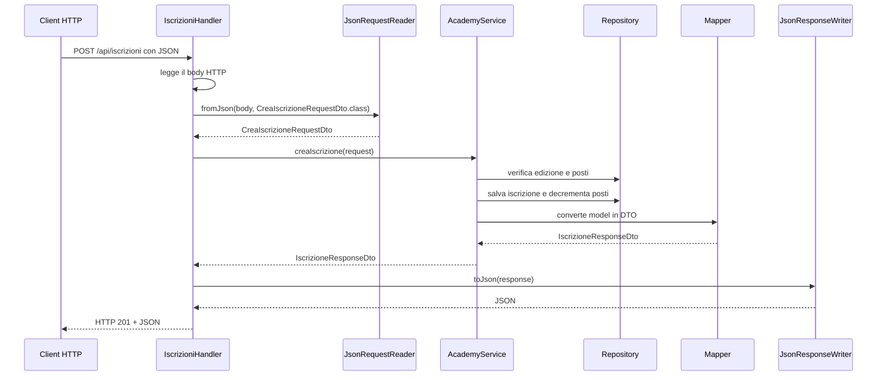

# LAB29 - Schema semplice dei componenti fondamentali

Mappa sintetica dei componenti della API iscrizioni.  
Il file serve come supporto docente per spiegare la struttura dell'applicazione senza ripetere tutto il codice.

---

## 1. Idea generale

L'applicazione è organizzata per livelli:

```text
Client HTTP
   ↓
Handler HTTP
   ↓
Service
   ↓
Repository in memoria
   ↓
Model interni
```

Il client non riceve direttamente i model interni.  
Le risposte passano attraverso mapper e DTO:

```text
Model interno → Mapper → DTO di risposta → JSON
```

Per la `POST /api/iscrizioni` il flusso in ingresso è:

```text
JSON ricevuto → JsonRequestReader → CreaIscrizioneRequestDto → Service
```

---

## 2. Schema essenziale del flusso logico

Questo schema riassume il percorso principale di una richiesta, soprattutto nel caso della `POST /api/iscrizioni`.



### Lettura rapida dello schema

| Componente | Ruolo essenziale |
|---|---|
| `Client HTTP` | Invia richieste e riceve risposte JSON. |
| `Controller / Handler` | Riceve la richiesta HTTP, coordina il flusso e invia la risposta. |
| `Request DTO` | Rappresenta i dati ricevuti dal client in forma strutturata. |
| `Service` | Applica le regole di business e decide cosa fare. |
| `Repository` | Accede ai dati in memoria. |
| `Model interno` | Rappresenta gli oggetti interni dell'applicazione. |
| `Mapper` | Converte i model interni nei DTO di risposta. |
| `Response DTO` | Contiene i dati da restituire al client. |
| `Jackson ObjectMapper` | Trasforma oggetti Java in JSON e, nel caso della richiesta, JSON in oggetti Java. |
| `JSON` | Formato testuale scambiato via HTTP. |

---

## 3. Schema dei componenti



---

## 4. Componenti principali

### `app`

| Classe | Spiegazione |
|---|---|
| `AcademyApiApplication` | Classe di avvio. Crea repository, service e handler, registra gli endpoint e avvia `HttpServer` sulla porta `8080`. |

---

### `model`

I model rappresentano gli oggetti interni dell'applicazione.

| Classe | Spiegazione |
|---|---|
| `Corso` | Rappresenta un corso dell'academy. Contiene codice, titolo, descrizione e stato di pubblicabilità. |
| `EdizioneCorso` | Rappresenta una edizione di un corso. Contiene corso collegato, docente, data, posti totali, posti disponibili e stato di pubblicazione. |
| `Iscrizione` | Rappresenta l'iscrizione di un partecipante a una edizione. Contiene anche la data di iscrizione. |

---

### `dto`

I DTO definiscono i dati scambiati con il client HTTP.

| Classe | Direzione | Spiegazione |
|---|---:|---|
| `CorsoResponseDto` | Output | DTO restituito per l'elenco dei corsi. Espone solo i dati utili al client. |
| `EdizioneDisponibileResponseDto` | Output | DTO restituito per le edizioni disponibili. Mostra corso, docente, data e posti disponibili. |
| `CreaIscrizioneRequestDto` | Input | DTO ricevuto dalla `POST /api/iscrizioni`. Deve avere costruttore vuoto, getter e setter per Jackson. |
| `IscrizioneResponseDto` | Output | DTO restituito dopo la creazione di una iscrizione o nell'elenco delle iscrizioni. |
| `ErroreResponseDto` | Output | DTO usato per restituire errori in formato JSON. |

---

### `mapper`

I mapper trasformano model interni in DTO.

| Classe | Spiegazione |
|---|---|
| `CorsoMapper` | Converte `Corso` in `CorsoResponseDto`. |
| `EdizioneMapper` | Converte `EdizioneCorso` in `EdizioneDisponibileResponseDto`. |
| `IscrizioneMapper` | Converte `Iscrizione` in `IscrizioneResponseDto`, recuperando anche dati da edizione e corso. |

---

### `repository`

I repository simulano il livello dati usando collezioni in memoria.

| Classe | Spiegazione |
|---|---|
| `CorsoRepository` | Conserva i corsi e permette di recuperarli tutti o per id. |
| `EdizioneCorsoRepository` | Conserva le edizioni, filtra quelle pubblicate e disponibili, e decrementa i posti. |
| `IscrizioneRepository` | Conserva le iscrizioni create e assegna un id progressivo al salvataggio. |

---

### `service`

| Classe | Spiegazione |
|---|---|
| `AcademyService` | Contiene le regole applicative. Valida la richiesta di iscrizione, verifica edizione e posti, salva l'iscrizione e restituisce DTO. |

Le regole applicative devono stare qui, non negli handler HTTP.

---

### `controller`

Gli handler ricevono richieste HTTP e restituiscono risposte JSON.

| Classe | Endpoint | Spiegazione |
|---|---|---|
| `HealthHandler` | `GET /health` | Verifica che la API sia attiva. |
| `CorsiHandler` | `GET /api/corsi` | Restituisce l'elenco dei corsi pubblicabili. |
| `EdizioniHandler` | `GET /api/edizioni` | Restituisce le edizioni pubblicate con posti disponibili. |
| `IscrizioniHandler` | `GET /api/iscrizioni`, `POST /api/iscrizioni` | Gestisce elenco e creazione iscrizioni. È la classe più importante per lettura body, deserializzazione JSON e gestione errori. |

---

### `util`

Le classi `util` isolano il lavoro tecnico sul JSON.

| Classe | Spiegazione |
|---|---|
| `JsonResponseWriter` | Converte oggetti Java in JSON usando Jackson. Serve per le risposte HTTP. |
| `JsonRequestReader` | Converte JSON in oggetti Java usando Jackson. Serve per leggere il body della `POST`. |

---

## 5. Classi da spiegare con maggiore attenzione

| Classe | Perché è importante |
|---|---|
| `CreaIscrizioneRequestDto` | È il punto di ingresso dei dati JSON. Permette di trasformare il body della richiesta in un oggetto Java. |
| `JsonRequestReader` | Introduce la deserializzazione: da JSON testuale a DTO Java. |
| `IscrizioniHandler` | Coordina la `POST`: legge il body, deserializza, chiama il service e restituisce la risposta. |
| `AcademyService` | Contiene validazioni e regole applicative: edizione esistente, nome valido, email valida, posti disponibili. |
| `EdizioneCorsoRepository` | Gestisce la disponibilità dei posti e il decremento dopo una iscrizione valida. |

---

## 6. Flusso della creazione iscrizione



---

## 7. Sintesi finale

| Livello | Responsabilità principale |
|---|---|
| `app` | Avvio e collegamento dei componenti. |
| `controller` | Gestione richieste e risposte HTTP. |
| `service` | Regole applicative. |
| `repository` | Dati in memoria. |
| `model` | Oggetti interni dell'applicazione. |
| `mapper` | Conversione da model a DTO. |
| `dto` | Dati esposti o ricevuti dalla API. |
| `util` | Serializzazione e deserializzazione JSON. |

La separazione dei livelli consente di spiegare chiaramente dove si trova ogni responsabilità e prepara il passaggio successivo verso DAO, database, framework web e repository reali.
