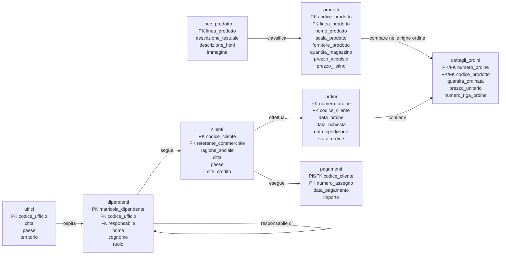

# LAB24 - Schema operativo del database `modelli_classici_it`

## Obiettivo del file

Questo file riepiloga le tabelle e le relazioni principali del database usato nel LAB24.

Il database rappresenta un contesto aziendale con catalogo prodotti, clienti, ordini, pagamenti, dipendenti e uffici commerciali.

---

## Tabelle principali

| Tabella | Contenuto principale |
|---|---|
| `linee_prodotto` | Categorie commerciali dei prodotti |
| `prodotti` | Catalogo prodotti, prezzi e giacenze |
| `clienti` | Anagrafica clienti e limite di credito |
| `ordini` | Testata degli ordini cliente |
| `dettagli_ordini` | Righe di dettaglio degli ordini |
| `pagamenti` | Pagamenti ricevuti dai clienti |
| `dipendenti` | Referenti commerciali e struttura gerarchica |
| `uffici` | Sedi aziendali in cui operano i dipendenti |

---

## Schema logico operativo



---

## Relazioni principali da usare nelle query

| Relazione | Condizione di join |
|---|---|
| Linea prodotto - Prodotto | `linee_prodotto.linea_prodotto = prodotti.linea_prodotto` |
| Prodotto - Dettaglio ordine | `prodotti.codice_prodotto = dettagli_ordini.codice_prodotto` |
| Ordine - Dettaglio ordine | `ordini.numero_ordine = dettagli_ordini.numero_ordine` |
| Cliente - Ordine | `clienti.codice_cliente = ordini.codice_cliente` |
| Cliente - Pagamento | `clienti.codice_cliente = pagamenti.codice_cliente` |
| Dipendente - Cliente | `dipendenti.matricola_dipendente = clienti.referente_commerciale` |
| Ufficio - Dipendente | `uffici.codice_ufficio = dipendenti.codice_ufficio` |
| Dipendente - Responsabile | `dipendenti.responsabile = responsabile.matricola_dipendente` |

Nella relazione Dipendente - Responsabile, `responsabile` è un alias della tabella `dipendenti` usato nelle self join.

Esempio:

```sql
SELECT
    d.matricola_dipendente,
    CONCAT(d.nome, ' ', d.cognome) AS dipendente,
    CONCAT(responsabile.nome, ' ', responsabile.cognome) AS responsabile
FROM dipendenti d
LEFT JOIN dipendenti responsabile
    ON d.responsabile = responsabile.matricola_dipendente;
```

---

## Lettura didattica delle relazioni

La tabella `dipendenti` ha tre relazioni importanti:

1. ogni dipendente appartiene a un ufficio tramite `codice_ufficio`;
2. un dipendente può essere referente commerciale di più clienti tramite `clienti.referente_commerciale`;
3. un dipendente può avere un responsabile, che è a sua volta un altro dipendente.

Queste tre relazioni sono utili per costruire report su clienti seguiti, performance commerciali e struttura organizzativa.
