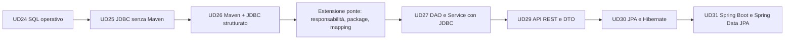

# UD26 - Maven essenziale e JDBC strutturato

## Contesto

Nella UD25 abbiamo collegato Java a MariaDB/MySQL senza Maven, gestendo manualmente driver `.jar`, classpath, compilazione ed esecuzione.

Questa scelta è stata utile per capire cosa accade realmente quando un programma Java deve parlare con un database. In un progetto reale, però, gestire manualmente librerie esterne e comandi di compilazione diventa rapidamente fragile.

In questa UD introduciamo Maven come struttura standard di progetto e riprendiamo JDBC in una forma più ordinata.

## Problema che gestiamo in questa UD

Una normale applicazione Java non contiene automaticamente il driver per parlare con MariaDB/MySQL.

Per collegarsi a un DBMS servono almeno:

- un database raggiungibile;
- un driver JDBC;
- una stringa di connessione;
- credenziali;
- codice Java che apra connessioni e invii SQL;
- una gestione corretta delle risorse.

Nella UD25 questi elementi sono stati gestiti manualmente.

In questa UD li gestiamo con una struttura Maven, in modo più vicino a un progetto professionale.

## Risultati attesi

Al termine della UD26 saremo in grado di:

### 1. Usare Maven come struttura standard di progetto

Riconosceremo il ruolo di:

```text
pom.xml
src/main/java
src/main/resources
src/test/java
target/
```

Distingueremo:

- codice sorgente;
- configurazione;
- dipendenze;
- comandi di compilazione;
- comandi di esecuzione.

### 2. Configurare una dipendenza esterna

Aggiungeremo al `pom.xml` il driver MariaDB Connector/J senza copiarlo manualmente nella cartella del progetto.

Esempio:

```xml
<dependency>
    <groupId>org.mariadb.jdbc</groupId>
    <artifactId>mariadb-java-client</artifactId>
    <version>3.5.3</version>
</dependency>
```

### 3. Aprire una connessione JDBC

Useremo:

- `DriverManager`;
- `Connection`;
- URL JDBC;
- username e password;
- database di destinazione.

### 4. Eseguire query in modo controllato

Useremo:

- `PreparedStatement`;
- parametri nelle query;
- `ResultSet`;
- `executeQuery()`;
- `executeUpdate()`;
- `try-with-resources`.

### 5. Separare responsabilità minime

Eviteremo di scrivere tutto nel `main`.

La soluzione minima distinguerà:

- configurazione della connessione;
- apertura della connessione;
- codice SQL;
- trasformazione delle righe del database in oggetti Java;
- avvio dell'applicazione.

### 6. Preparare la UD27

In questa UD il repository sarà ancora semplice e vicino al codice JDBC.

Nella fase finale useremo una estensione ponte per osservare meglio responsabilità, package, mapping e casi anomali.

Nella UD27 riorganizzeremo questo codice in un DAO più completo, con interfacce, implementazioni e separazione più netta tra accesso ai dati e logica applicativa.

## Sistemi operativi gestiti nei laboratori

Nei laboratori useremo comandi equivalenti per:

- Windows PowerShell;
- Linux;
- macOS.

Quando il comando cambia tra sistemi operativi, saranno indicate entrambe le versioni.

La differenza più importante, già vista nella UD25, riguarda il classpath manuale. Con Maven questa differenza diventa meno visibile perché il comando `mvn` gestisce compilazione e dipendenze in modo uniforme.

## Sequenza della UD

| Fase | Attività | Durata indicativa |
|---|---:|---:|
| 1 | Ripresa UD25, Maven essenziale, `pom.xml`, dipendenze, struttura progetto | 1h 15m |
| 2 | JDBC base con Maven: connessione, query, `PreparedStatement`, `ResultSet` | 1h 15m |
| 3 | Laboratorio guidato | 2h |
| 4 | Laboratorio autonomo | 2h 15m |
| 5 | Estensione ponte verso UD27: package, mapping, casi anomali, metodi aggiuntivi | 1h 30m |
| 6 | Verifica, discussione e troubleshooting | 45m |

## Collegamento con le UD successive



## Idea chiave

JDBC rende visibile il lavoro necessario per parlare con un database.

Maven rende gestibili struttura del progetto e dipendenze.

Capire questi due strumenti permette di comprendere meglio perché, nelle UD successive, DAO, JPA, Spring Data e Spring Boot semplificano molte operazioni ripetitive.


## Estensione di consolidamento

La UD26 include un file aggiuntivo di estensione: `08_Estensione_UD26_ponte_verso_UD27.md`.

Questa attività serve a rendere più solida la giornata da 8 ore e a evitare un salto troppo brusco verso DAO e Service. L'estensione lavora ancora sul progetto Maven + JDBC della UD26, ma introduce un primo riordino dei package, due metodi aggiuntivi del repository e una verifica ragionata dei casi anomali.
