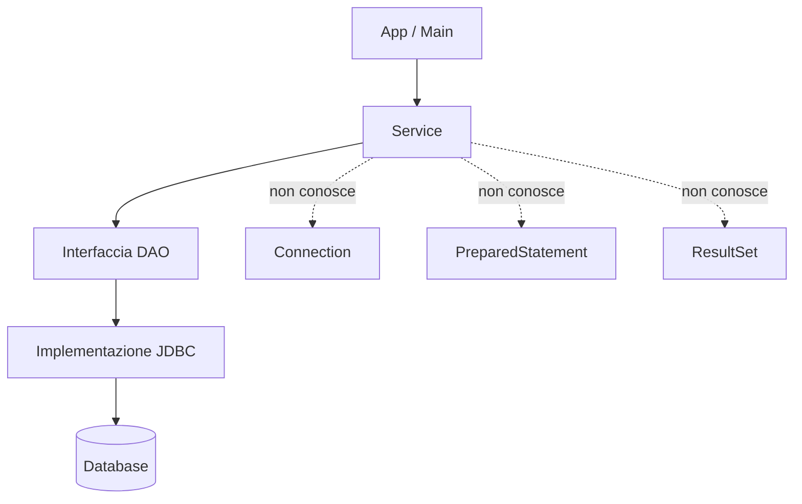

# 01 - Il pattern DAO applicato a JDBC

## Che cos'è un DAO

DAO significa **Data Access Object**.

Un DAO è una classe o un insieme di classi che ha la responsabilità di accedere ai dati, nascondendo al resto dell'applicazione i dettagli tecnici della persistenza.

Nel nostro caso la persistenza è realizzata con:

- MariaDB/MySQL;
- JDBC;
- `Connection`;
- `PreparedStatement`;
- `ResultSet`.

Il resto dell'applicazione non dovrebbe dipendere direttamente da questi dettagli.

## Prima del DAO

Senza DAO il codice tende a crescere in modo poco ordinato:

```java
public void stampaDocenti() throws SQLException {
    String sql = "SELECT id, nome, email FROM docenti";

    try (Connection conn = DriverManager.getConnection(url, user, password);
         PreparedStatement ps = conn.prepareStatement(sql);
         ResultSet rs = ps.executeQuery()) {

        while (rs.next()) {
            System.out.println(rs.getString("nome"));
        }
    }
}
```

Il codice funziona, ma non è collocato nel posto giusto se viene inserito nel `main`, in una classe di menu o in un controller.

## Dopo il DAO

Con il DAO separiamo il contratto dall'implementazione.

### Interfaccia DAO

```java
public interface DocenteDao {
    List<Docente> findAll();
    Optional<Docente> findById(int id);
}
```

L'interfaccia descrive cosa si può fare.

### Implementazione JDBC

```java
public class JdbcDocenteDao implements DocenteDao {
    private final DbConnectionFactory connectionFactory;

    public JdbcDocenteDao(DbConnectionFactory connectionFactory) {
        this.connectionFactory = connectionFactory;
    }

    @Override
    public List<Docente> findAll() {
        // codice JDBC
    }
}
```

L'implementazione contiene il codice specifico JDBC.

### Service

```java
public class DocenteService {
    private final DocenteDao docenteDao;

    public DocenteService(DocenteDao docenteDao) {
        this.docenteDao = docenteDao;
    }
}
```

Il service usa il contratto `DocenteDao`, non la classe concreta `JdbcDocenteDao`.

## Responsabilità dei livelli



Il punto principale è questo: il service deve poter ragionare in termini applicativi, non in termini di driver JDBC.

## Interfacce e polimorfismo

L'interfaccia DAO permette di sostituire l'implementazione senza cambiare il service.

| Contratto | Possibile implementazione |
|---|---|
| `CorsoDao` | `JdbcCorsoDao` |
| `CorsoDao` | `InMemoryCorsoDao` |
| `CorsoDao` | `JpaCorsoRepository`, più avanti |

Questo è un uso concreto del polimorfismo: il service lavora con un tipo astratto e non dipende direttamente dalla classe concreta.

## Metodi DAO ben progettati

Un DAO non dovrebbe contenere metodi legati alla stampa, al menu o all'interazione con l'utente.

Esempi corretti:

```java
List<Corso> findAll();
Optional<Corso> findById(int id);
Corso save(Corso corso);
boolean deleteById(int id);
```

Esempi da evitare:

```java
void stampaTuttiICorsi();
void chiediDatiCorsoDaScanner();
void eseguiMenuGestioneCorsi();
```

La stampa appartiene all'applicazione o alla view. La lettura da tastiera appartiene all'interfaccia utente. Il DAO deve occuparsi dell'accesso ai dati.

## DAO e CRUD

| Operazione CRUD | Metodo DAO tipico | SQL tipico |
|---|---|---|
| Create | `save()` | `INSERT` |
| Read | `findById()`, `findAll()` | `SELECT` |
| Update | `update()` | `UPDATE` |
| Delete | `deleteById()` | `DELETE` |

## Errore comune

Un errore frequente è creare un DAO che in realtà fa tutto: legge input, applica regole, stampa output ed esegue query SQL.

In questa UD il DAO deve avere una responsabilità precisa: comunicare con la sorgente dati e restituire oggetti Java al resto dell'applicazione.
