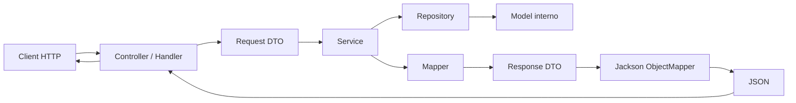

# UD29 - API REST, DTO, JSON e architettura a livelli

## Durata

8 ore complessive, distribuite in due sessioni da 4 ore.

La prima sessione introduce HTTP, JSON, DTO, mapper, serializzazione con Jackson e struttura di una API locale. La seconda sessione consolida l'architettura a livelli attraverso un laboratorio autonomo.

## Collocazione nel percorso

Finora abbiamo lavorato su applicazioni Java con model, repository/DAO, service, JDBC, Maven e una prima organizzazione del codice in package con responsabilità distinte.

In questa unità spostiamo il punto di osservazione: l'applicazione non viene usata solo dall'interno, ma espone funzionalità verso un client esterno attraverso richieste HTTP e risposte JSON.

Per questo diventa importante distinguere tra:

- dati gestiti internamente dall'applicazione;
- oggetti usati dalla logica applicativa;
- dati ricevuti da una richiesta HTTP;
- dati restituiti come risposta della API;
- rappresentazione JSON inviata al client.

Il DTO viene introdotto per gestire in modo ordinato questo confine.

## Scopo della UD

In questa UD costruiamo una API REST didattica locale. Non usiamo ancora Spring Boot e non usiamo un database. Il repository resta in memoria per concentrare il lavoro su responsabilità applicative, DTO, mapper, JSON e flusso HTTP.

A differenza di una costruzione completamente manuale del JSON, useremo **Jackson**, una libreria Java diffusa per convertire oggetti Java in JSON e JSON in oggetti Java.

Questa scelta prepara meglio il passaggio successivo a Spring Boot, dove Jackson viene usato automaticamente dal framework.

## Strumenti usati

| Strumento | Uso nella UD |
|---|---|
| JDK 17 o superiore | Compilazione ed esecuzione Java |
| Maven | Gestione progetto e dipendenze |
| Jackson | Serializzazione e deserializzazione JSON |
| `HttpServer` del JDK | Server HTTP locale didattico |
| Terminale | Avvio applicazione e test endpoint |
| `curl` o PowerShell `Invoke-RestMethod` | Test delle API |

Docker e database non sono richiesti.

## Risultati attesi

Al termine della UD saremo in grado di:

1. distinguere model interno, DTO e JSON;
2. progettare DTO diversi per richiesta e risposta;
3. scrivere mapper manuali tra model e DTO;
4. evitare di esporre direttamente gli oggetti interni nelle API;
5. progettare endpoint REST elementari con metodi HTTP e status code coerenti;
6. usare Jackson per convertire oggetti Java in JSON e JSON in oggetti Java;
7. distinguere il ruolo di handler/controller, service, repository, model, DTO e mapper;
8. documentare le scelte progettuali nel file di evidenza.

## Concetto guida

```text
Il model rappresenta lo stato interno.
Il DTO rappresenta i dati trasferiti in uno specifico caso d'uso.
Il JSON è il formato testuale scambiato via HTTP.
La API espone un contratto verso l'esterno.
```

## Concetti che compariranno nel laboratorio guidato

| Concetto/classe | Significato |
|---|---|
| `HttpServer` | Server HTTP locale fornito dal JDK |
| `HttpHandler` | Componente che gestisce uno specifico endpoint |
| `HttpExchange` | Oggetto che rappresenta richiesta e risposta HTTP |
| DTO | Oggetto Java usato per dati in ingresso o in uscita dalla API |
| Mapper | Classe che converte model in DTO o DTO in model |
| `ObjectMapper` | Classe di Jackson usata per convertire Java ↔ JSON |
| Service | Livello che contiene regole applicative |
| Repository | Livello che fornisce i dati, in questa UD in memoria |

## Flusso concettuale



## Errore da evitare

Una scorciatoia frequente è restituire direttamente un model interno dalla API.

```java
public Corso dettaglioCorso(long id) {
    return corsoService.trovaPerId(id);
}
```

Questa scelta lega il contratto esterno della API alla struttura interna dell'applicazione. Se il model cambia per motivi interni, cambia anche ciò che viene esposto al client.

## Scelta corretta

La API dovrebbe restituire un DTO progettato per il caso d'uso.

```java
public CorsoResponseDto dettaglioCorso(long id) {
    Corso corso = corsoService.trovaPerId(id);
    return CorsoMapper.toResponseDto(corso);
}
```

Il DTO viene poi serializzato in JSON.

```java
String json = objectMapper.writeValueAsString(dto);
```

In UD29 lo facciamo esplicitamente con Jackson. In UD31 Spring Boot gestirà questa conversione in modo automatico quando un controller REST restituisce un DTO.
