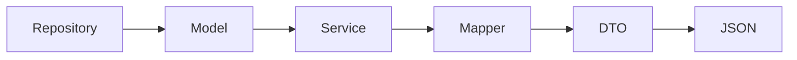

# 02 - DTO, mapper e contratti API

## Obiettivo

Comprendere come progettare DTO di richiesta, DTO di risposta, DTO di errore e mapper manuali.

Una API è un contratto: il client deve sapere quali dati inviare e quali dati riceverà. I DTO servono a rendere questo contratto esplicito.

## DTO di richiesta e DTO di risposta

Una API riceve e restituisce dati in forme diverse. Per questo conviene separare i DTO di input dai DTO di output.

| Tipo DTO | Direzione | Scopo |
|---|---|---|
| Request DTO | Client → Applicazione | Ricevere solo i dati ammessi in ingresso |
| Response DTO | Applicazione → Client | Restituire solo i dati necessari al client |
| Error DTO | Applicazione → Client | Restituire errori in formato coerente |

## Esempio: creazione iscrizione

JSON ricevuto dal client:

```json
{
  "edizioneId": 1,
  "nomePartecipante": "Mario Rossi",
  "emailPartecipante": "mario.rossi@example.com"
}
```

DTO di richiesta:

```java
public class CreaIscrizioneRequestDto {
    private long edizioneId;
    private String nomePartecipante;
    private String emailPartecipante;

    public CreaIscrizioneRequestDto() {
    }

    public long getEdizioneId() {
        return edizioneId;
    }

    public void setEdizioneId(long edizioneId) {
        this.edizioneId = edizioneId;
    }

    public String getNomePartecipante() {
        return nomePartecipante;
    }

    public void setNomePartecipante(String nomePartecipante) {
        this.nomePartecipante = nomePartecipante;
    }

    public String getEmailPartecipante() {
        return emailPartecipante;
    }

    public void setEmailPartecipante(String emailPartecipante) {
        this.emailPartecipante = emailPartecipante;
    }
}
```

Il costruttore vuoto e i setter sono utili quando una libreria come Jackson deve creare l'oggetto partendo dal JSON.

DTO di risposta:

```java
public class IscrizioneResponseDto {
    private long id;
    private String nomePartecipante;
    private String emailPartecipante;
    private String titoloCorso;
    private String dataInizio;
    private String stato;

    public IscrizioneResponseDto(long id, String nomePartecipante, String emailPartecipante,
                                 String titoloCorso, String dataInizio, String stato) {
        this.id = id;
        this.nomePartecipante = nomePartecipante;
        this.emailPartecipante = emailPartecipante;
        this.titoloCorso = titoloCorso;
        this.dataInizio = dataInizio;
        this.stato = stato;
    }

    // getter
}
```

La richiesta contiene pochi dati essenziali. La risposta contiene dati arricchiti, più adatti al client.

## DTO di errore

Una API dovrebbe restituire errori leggibili e coerenti.

```java
public class ErroreResponseDto {
    private String codice;
    private String messaggio;

    public ErroreResponseDto(String codice, String messaggio) {
        this.codice = codice;
        this.messaggio = messaggio;
    }

    public String getCodice() {
        return codice;
    }

    public String getMessaggio() {
        return messaggio;
    }
}
```

Esempio JSON:

```json
{
  "codice": "DATI_NON_VALIDI",
  "messaggio": "L'email del partecipante non è valida"
}
```

## Mapper

Il mapper è una classe dedicata alla conversione tra model e DTO.

```java
public class CorsoMapper {

    private CorsoMapper() {
    }

    public static CorsoResponseDto toResponseDto(Corso corso) {
        return new CorsoResponseDto(
                corso.getId(),
                corso.getTitolo(),
                corso.getPrezzo()
        );
    }
}
```

## Perché non mettere il mapping nel controller

Il controller deve gestire la richiesta HTTP e delegare il lavoro ai livelli corretti. Se il controller costruisce manualmente tutti i DTO, diventa difficile da leggere e accumula responsabilità non sue.

Da evitare:

```java
public void handle(HttpExchange exchange) {
    Corso corso = service.trovaCorso(1);
    CorsoResponseDto dto = new CorsoResponseDto(
            corso.getId(),
            corso.getTitolo(),
            corso.getPrezzo()
    );
}
```

Meglio:

```java
public void handle(HttpExchange exchange) {
    CorsoResponseDto dto = service.trovaCorsoPubblico(1);
}
```

oppure:

```java
CorsoResponseDto dto = CorsoMapper.toResponseDto(corso);
```

in un punto dedicato e facilmente riconoscibile.

## Dove si colloca il mapper



Il mapper non deve aprire connessioni, non deve conoscere HTTP e non deve applicare regole complesse. Deve convertire dati.

## Contratto API

Il contratto API è l'insieme di:

- endpoint;
- metodo HTTP;
- DTO di richiesta;
- DTO di risposta;
- status code;
- formato degli errori.

Esempio:

| Elemento | Valore |
|---|---|
| Endpoint | `/api/iscrizioni` |
| Metodo | `POST` |
| Request DTO | `CreaIscrizioneRequestDto` |
| Response DTO | `IscrizioneResponseDto` |
| Successo | `201 Created` |
| Errore dati | `400 Bad Request` con `ErroreResponseDto` |

## Domande di controllo

1. Perché una `POST` usa un request DTO?
2. Perché una risposta può usare un DTO diverso da quello della richiesta?
3. Perché il mapper non dovrebbe stare nel controller?
4. Quale DTO useremmo per restituire un errore applicativo?
5. Perché il contratto API deve rimanere stabile anche se cambia il model interno?
