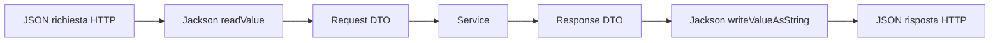

# 03 - HTTP, API REST, JSON e Jackson

## Obiettivo

Riprendere i concetti essenziali di HTTP, API REST, JSON e serializzazione necessari per costruire una API locale testabile.

## API REST

Una API REST espone risorse tramite URL e usa i metodi HTTP per rappresentare le operazioni principali.

| Metodo HTTP | Uso tipico | Esempio |
|---|---|---|
| GET | leggere dati | `GET /api/corsi` |
| POST | creare una risorsa | `POST /api/iscrizioni` |
| PUT | sostituire una risorsa | `PUT /api/corsi/10` |
| PATCH | aggiornare parzialmente | `PATCH /api/corsi/10/prezzo` |
| DELETE | eliminare | `DELETE /api/corsi/10` |

In questa UD usiamo soprattutto `GET` e `POST`.

## JSON

JSON è un formato testuale usato per scambiare dati tra client e server.

```json
{
  "edizioneId": 2,
  "nomePartecipante": "Mario Rossi",
  "emailPartecipante": "mario.rossi@example.com"
}
```

Nel codice Java questo contenuto viene letto e trasformato in un DTO di richiesta.

## Serializzazione e deserializzazione

| Operazione | Direzione | Significato |
|---|---|---|
| Serializzazione | Java → JSON | Un DTO Java diventa testo JSON |
| Deserializzazione | JSON → Java | Il body JSON di una richiesta diventa un DTO Java |

Esempio di serializzazione:

```java
ObjectMapper mapper = new ObjectMapper();
String json = mapper.writeValueAsString(dto);
```

Esempio di deserializzazione:

```java
CreaIscrizioneRequestDto request = mapper.readValue(
        json,
        CreaIscrizioneRequestDto.class
);
```

## Perché usiamo Jackson

Il server HTTP minimale del JDK non trasforma automaticamente oggetti Java in JSON. Per questo usiamo Jackson.

Jackson ci permette di evitare codice fragile come:

```java
String json = "{\"titolo\":\"" + titolo + "\"}";
```

Questa forma è da evitare perché diventa rapidamente difficile da mantenere e può produrre JSON non valido.

## Status code principali

| Codice | Significato | Uso nel laboratorio |
|---|---|---|
| 200 | OK | richiesta completata |
| 201 | Created | risorsa creata |
| 400 | Bad Request | dati non validi o JSON non valido |
| 404 | Not Found | risorsa non trovata |
| 405 | Method Not Allowed | metodo HTTP non supportato |
| 500 | Internal Server Error | errore non gestito |

## Header `Content-Type`

Quando la API restituisce JSON, deve dichiararlo nella risposta HTTP.

```java
exchange.getResponseHeaders().set("Content-Type", "application/json; charset=utf-8");
```

Quando il client invia JSON con una `POST`, usa invece:

```text
Content-Type: application/json
```

## Endpoint del laboratorio autonomo

| Endpoint | Metodo | Descrizione |
|---|---|---|
| `/health` | GET | controllo stato API |
| `/api/corsi` | GET | elenco corsi pubblicabili |
| `/api/edizioni` | GET | elenco edizioni con disponibilità |
| `/api/iscrizioni` | GET | elenco iscrizioni |
| `/api/iscrizioni` | POST | creazione iscrizione |

## Esempio di POST

### Linux/macOS

```bash
curl -X POST http://localhost:8080/api/iscrizioni \
  -H "Content-Type: application/json" \
  -d '{"edizioneId":1,"nomePartecipante":"Mario Rossi","emailPartecipante":"mario.rossi@example.com"}'
```

### Windows PowerShell

```powershell
$body = '{"edizioneId":1,"nomePartecipante":"Mario Rossi","emailPartecipante":"mario.rossi@example.com"}'
Invoke-RestMethod -Method Post -Uri "http://localhost:8080/api/iscrizioni" -ContentType "application/json" -Body $body
```

## Relazione tra JSON e DTO



## Domande di controllo

1. Perché il JSON è testo mentre il DTO è un oggetto Java?
2. Che differenza c'è tra serializzazione e deserializzazione?
3. Perché serve Jackson in una API basata su `HttpServer` del JDK?
4. Perché una risposta JSON deve avere `Content-Type: application/json`?
5. Quale status code useresti per una richiesta con email non valida?
