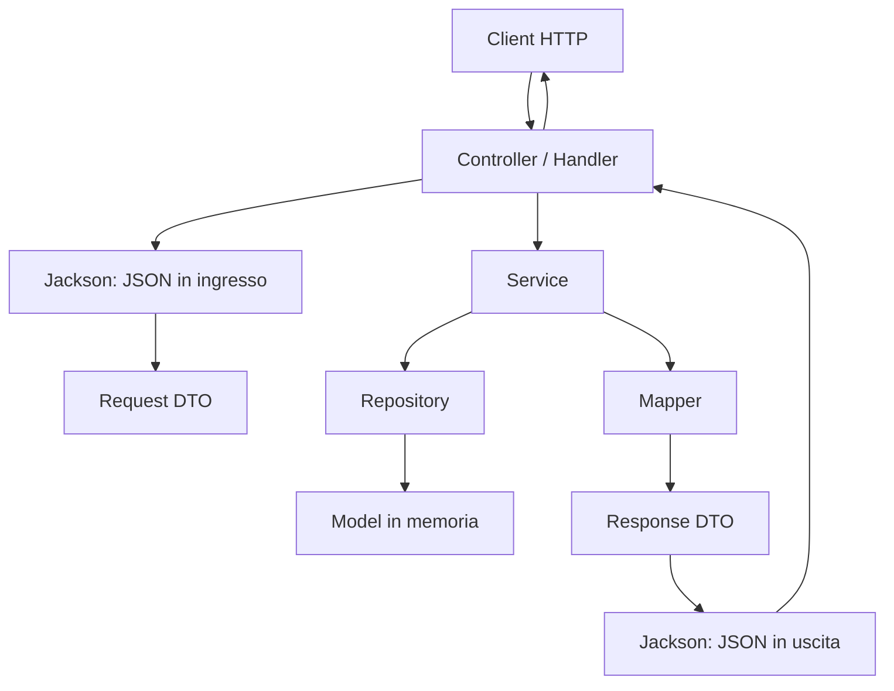

# 04 - API REST didattica e architettura a livelli

## Obiettivo

Costruire una API locale rispettando una separazione chiara tra responsabilità applicative.

In questa UD non realizziamo ancora una architettura a microservizi completa. Prepariamo però una struttura coerente: ogni responsabilità ha un punto preciso nel codice.

## Struttura minima



## Package consigliati

```text
app
controller
dto
exception
http
mapper
model
repository
service
util
```

| Package | Responsabilità |
|---|---|
| `app` | Avvio dell'applicazione e registrazione endpoint |
| `controller` | Gestione richieste HTTP tramite handler |
| `dto` | Oggetti usati in ingresso e uscita dalla API |
| `exception` | Eccezioni applicative controllate |
| `http` | Eventuali costanti o utility legate a status code e lettura body |
| `mapper` | Conversione tra model e DTO |
| `model` | Oggetti interni del dominio |
| `repository` | Dati in memoria e operazioni di accesso |
| `service` | Regole applicative e coordinamento |
| `util` | Supporto tecnico, per esempio serializzazione JSON |

## Ruolo delle classi principali

| Classe | Responsabilità |
|---|---|
| `CatalogoApiApplication` | Crea il server HTTP e registra gli endpoint |
| `CorsiHandler` | Gestisce `GET /api/corsi` |
| `CatalogoService` | Applica la regola: pubblicare solo corsi attivi |
| `CorsoRepository` | Fornisce i dati dei corsi in memoria |
| `CorsoMapper` | Converte `Corso` in `CorsoResponseDto` |
| `JsonResponseWriter` | Usa Jackson per trasformare DTO in JSON |

## Cosa deve fare il controller/handler

Il controller o handler deve:

- leggere metodo HTTP e path;
- leggere il body della richiesta quando serve;
- delegare al service;
- trasformare la risposta in JSON;
- impostare status code e header HTTP.

Non deve contenere query, accesso diretto ai dati o regole applicative complesse.

## Cosa deve fare il service

Il service deve:

- applicare regole di business;
- validare i dati principali;
- coordinare repository e mapper;
- restituire DTO o risultati applicativi coerenti.

Esempio:

```java
public List<CorsoResponseDto> elencoCorsiPubblici() {
    return repository.findAll().stream()
            .filter(Corso::isAttivo)
            .map(CorsoMapper::toResponseDto)
            .toList();
}
```

Qui la regola “solo corsi attivi” non sta nell'handler.

## Cosa deve fare il repository

Il repository deve fornire dati.

In questa UD i dati sono in memoria:

```java
private final List<Corso> corsi = List.of(...);
```

Nelle UD successive il repository tornerà a collegarsi a un database, prima con JPA/Hibernate e poi con Spring Data JPA.

## Flusso di una richiesta `GET /api/corsi`

```text
1. Il client chiama GET /api/corsi.
2. HttpServer invoca CorsiHandler.
3. CorsiHandler verifica che il metodo sia GET.
4. CorsiHandler chiama CatalogoService.
5. CatalogoService legge i corsi dal repository.
6. CatalogoService filtra i corsi attivi.
7. CatalogoService produce DTO di risposta.
8. CorsiHandler serializza i DTO in JSON con Jackson.
9. CorsiHandler invia status code, header e body.
```

## Flusso di una richiesta `POST /api/iscrizioni`

```text
1. Il client invia JSON nel body.
2. L'handler legge il body come testo.
3. Jackson deserializza il JSON in un request DTO.
4. Il service valida i dati.
5. Il repository registra l'iscrizione in memoria.
6. Il mapper crea un response DTO.
7. Jackson serializza il response DTO in JSON.
8. L'handler risponde con 201 Created.
```

## Differenza tra handler e service

| Aspetto | Handler / Controller | Service |
|---|---|---|
| Conosce HTTP | Sì | No |
| Conosce status code | Sì | No |
| Legge il body della richiesta | Sì | No |
| Applica regole applicative | Solo delega | Sì |
| Usa direttamente repository | Meglio evitare | Sì |
| Produce JSON | Coordina la serializzazione | No, restituisce DTO o risultati |

## Domande di controllo

1. Perché il service non dovrebbe conoscere `HttpExchange`?
2. Perché il repository non dovrebbe restituire direttamente JSON?
3. In quale livello va la regola “non iscrivere se i posti sono terminati”?
4. Quale classe decide lo status code della risposta?
5. Quale classe converte il model in DTO?
