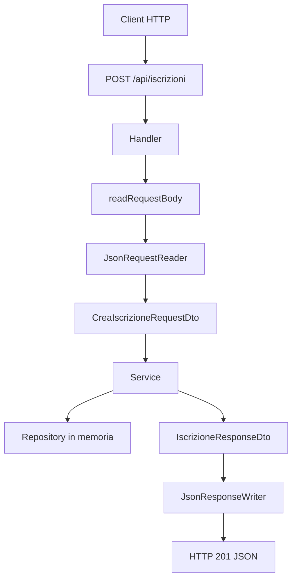

# LAB29 autonomo - API iscrizioni con DTO, Jackson e deserializzazione guidata

## Scenario

Realizzare una API locale per gestire le iscrizioni alle edizioni dei corsi di una academy.

L'applicazione deve esporre endpoint HTTP in JSON, ma non deve restituire direttamente i model interni. Il lavoro richiede di progettare e implementare model, DTO, mapper, repository in memoria, service con regole applicative e handler HTTP.

In questo laboratorio la parte di **deserializzazione JSON**, cioè la conversione del body della richiesta `POST` in un oggetto Java, viene fornita in modo guidato. Il motivo è semplice: nel laboratorio guidato abbiamo visto soprattutto la serializzazione, cioè il passaggio da DTO Java a JSON. Qui, con `POST /api/iscrizioni`, compare anche il percorso inverso:

```text
JSON ricevuto nel body HTTP
↓
CreaIscrizioneRequestDto
↓
service
↓
IscrizioneResponseDto
↓
JSON di risposta
```

La parte autonoma resta concentrata sulla progettazione dei livelli, sulle regole applicative e sull'uso dei DTO.

---

## Requisiti software

| Software | Utilizzo |
|---|---|
| JDK 17 o superiore | Compilazione ed esecuzione |
| Maven | Build e dipendenze |
| Terminale | Comandi Maven, `curl` o `Invoke-RestMethod` |
| Editor Java | Scrittura del codice |

Docker e database non sono richiesti.

---

## Vincolo importante

Non costruire JSON concatenando stringhe.

Usare Jackson per:

- convertire DTO di risposta in JSON;
- convertire il body JSON della `POST` in un request DTO.

Nel laboratorio useremo quindi:

| Operazione | Direzione | Classe di supporto |
|---|---|---|
| Serializzazione | Java DTO → JSON | `JsonResponseWriter` |
| Deserializzazione | JSON → Java DTO | `JsonRequestReader` |
| Lettura del body HTTP | byte ricevuti → testo JSON | metodo `readRequestBody` nell'handler |

---

## Endpoint richiesti

| Endpoint | Metodo | Descrizione |
|---|---|---|
| `/health` | GET | restituisce stato della API |
| `/api/corsi` | GET | restituisce i corsi pubblicabili |
| `/api/edizioni` | GET | restituisce le edizioni con disponibilità |
| `/api/iscrizioni` | GET | restituisce le iscrizioni registrate |
| `/api/iscrizioni` | POST | crea una nuova iscrizione |

---

## Model interni richiesti

Creare almeno questi model:

- `Corso`;
- `EdizioneCorso`;
- `Iscrizione`.

I model possono contenere più dati rispetto a quelli restituiti dalle API.

Esempio: il model `EdizioneCorso` può contenere un riferimento al corso, al docente, ai posti disponibili e allo stato interno. Il DTO di risposta può invece esporre solo i dati utili al client.

---

## DTO richiesti

| DTO | Direzione | Uso |
|---|---|---|
| `CorsoResponseDto` | output | elenco corsi pubblicabili |
| `EdizioneDisponibileResponseDto` | output | elenco edizioni con posti disponibili |
| `CreaIscrizioneRequestDto` | input | creazione iscrizione |
| `IscrizioneResponseDto` | output | iscrizione creata o elenco iscrizioni |
| `ErroreResponseDto` | output | messaggi di errore |

### Nota importante sul DTO di richiesta

Il DTO di richiesta deve avere:

- costruttore vuoto;
- getter;
- setter.

Jackson deve poter creare un oggetto vuoto e valorizzare i campi leggendo il JSON ricevuto nella `POST`.

Esempio guidato:

```java
package corso.ud29.academy.dto;

public class CreaIscrizioneRequestDto {
    private long edizioneId;
    private String nomePartecipante;
    private String emailPartecipante;

    public CreaIscrizioneRequestDto() {
    }

    public long getEdizioneId() {
        return edizioneId;
    }

    public void setEdizioneId(long edizioneId) {
        this.edizioneId = edizioneId;
    }

    public String getNomePartecipante() {
        return nomePartecipante;
    }

    public void setNomePartecipante(String nomePartecipante) {
        this.nomePartecipante = nomePartecipante;
    }

    public String getEmailPartecipante() {
        return emailPartecipante;
    }

    public void setEmailPartecipante(String emailPartecipante) {
        this.emailPartecipante = emailPartecipante;
    }
}
```

Questo DTO corrisponde a un body JSON di questo tipo:

```json
{
  "edizioneId": 1,
  "nomePartecipante": "Mario Rossi",
  "emailPartecipante": "mario.rossi@example.com"
}
```

---

## Mapper richiesti

Creare mapper manuali per:

- `CorsoMapper`;
- `EdizioneMapper`;
- `IscrizioneMapper`.

I mapper devono evitare che gli handler costruiscano direttamente i DTO.

Esempio di responsabilità:

| Classe | Responsabilità |
|---|---|
| `Iscrizione` | model interno dell'iscrizione |
| `IscrizioneResponseDto` | dati restituiti al client |
| `IscrizioneMapper` | conversione `Iscrizione` → `IscrizioneResponseDto` |

---

## Regole applicative minime

Il service deve controllare che:

1. l'edizione indicata esista;
2. il nome del partecipante non sia vuoto;
3. l'email contenga almeno il carattere `@`;
4. non venga superato il numero massimo di posti;
5. la risposta della creazione iscrizione sia un DTO, non il model interno.

La validazione deve stare nel service, non nell'handler HTTP.

L'handler riceve la richiesta HTTP, legge il JSON e chiama il service. Il service decide se l'operazione è valida.

---

## Struttura consigliata

```text
UD29_iscrizioni_api/
  pom.xml
  src/main/java/corso/ud29/academy/
    app/
    controller/
    dto/
    exception/
    mapper/
    model/
    repository/
    service/
    util/
  docs/
```

---

## Dipendenza Jackson nel `pom.xml`

Nel `pom.xml` deve essere presente:

```xml
<dependency>
    <groupId>com.fasterxml.jackson.core</groupId>
    <artifactId>jackson-databind</artifactId>
    <version>2.17.2</version>
</dependency>
```

Configurare anche l'`exec-maven-plugin` con main class:

```text
corso.ud29.academy.app.AcademyApiApplication
```

---

# Parte guidata - Supporto JSON

Questa parte è guidata perché introduce il punto più delicato del laboratorio autonomo: leggere il body JSON di una `POST` e trasformarlo in un DTO Java.

## Passo 1 - Creare `JsonResponseWriter`

Creare il file:

```text
src/main/java/corso/ud29/academy/util/JsonResponseWriter.java
```

Inserire il codice:

```java
package corso.ud29.academy.util;

import com.fasterxml.jackson.core.JsonProcessingException;
import com.fasterxml.jackson.databind.ObjectMapper;

public class JsonResponseWriter {

    private static final ObjectMapper objectMapper = new ObjectMapper();

    private JsonResponseWriter() {
    }

    public static String toJson(Object value) {
        try {
            return objectMapper.writeValueAsString(value);
        } catch (JsonProcessingException e) {
            throw new RuntimeException("Errore durante la produzione del JSON", e);
        }
    }
}
```

### Spiegazione

Il metodo:

```java
objectMapper.writeValueAsString(value)
```

converte un oggetto Java in una stringa JSON.

Esempio:

```java
IscrizioneResponseDto dto = new IscrizioneResponseDto(...);
String json = JsonResponseWriter.toJson(dto);
```

Risultato concettuale:

```text
IscrizioneResponseDto
↓
JSON da inviare nel body della risposta HTTP
```

---

## Passo 2 - Creare `JsonRequestReader`

Creare il file:

```text
src/main/java/corso/ud29/academy/util/JsonRequestReader.java
```

Inserire il codice:

```java
package corso.ud29.academy.util;

import com.fasterxml.jackson.core.JsonProcessingException;
import com.fasterxml.jackson.databind.ObjectMapper;

public class JsonRequestReader {

    private static final ObjectMapper objectMapper = new ObjectMapper();

    private JsonRequestReader() {
    }

    public static <T> T fromJson(String json, Class<T> type) {
        try {
            return objectMapper.readValue(json, type);
        } catch (JsonProcessingException e) {
            throw new IllegalArgumentException("JSON non valido", e);
        }
    }
}
```

### Spiegazione

Il metodo:

```java
objectMapper.readValue(json, type)
```

converte una stringa JSON in un oggetto Java del tipo indicato.

Esempio:

```java
CreaIscrizioneRequestDto request = JsonRequestReader.fromJson(
        body,
        CreaIscrizioneRequestDto.class
);
```

Risultato concettuale:

```text
JSON ricevuto nella POST
↓
CreaIscrizioneRequestDto
```

Il parametro:

```java
CreaIscrizioneRequestDto.class
```

serve a indicare a Jackson quale classe deve creare.

---

## Passo 3 - Leggere il body della richiesta HTTP

Dentro l'handler che gestisce `/api/iscrizioni`, aggiungere un metodo di supporto:

```java
private String readRequestBody(HttpExchange exchange) throws IOException {
    return new String(exchange.getRequestBody().readAllBytes(), StandardCharsets.UTF_8);
}
```

### Spiegazione riga per riga

```java
exchange.getRequestBody()
```

recupera il flusso dei dati inviati dal client nel body HTTP.

```java
readAllBytes()
```

legge tutti i byte ricevuti.

```java
new String(..., StandardCharsets.UTF_8)
```

trasforma i byte in testo usando la codifica UTF-8.

Il risultato è una stringa JSON, ad esempio:

```json
{"edizioneId":1,"nomePartecipante":"Mario Rossi","emailPartecipante":"mario.rossi@example.com"}
```

---

## Passo 4 - Usare la deserializzazione nella `POST /api/iscrizioni`

Nell'handler delle iscrizioni, la gestione della `POST` deve seguire questo flusso:

```text
1. leggere il body HTTP
2. trasformare il JSON in CreaIscrizioneRequestDto
3. passare il DTO al service
4. ricevere un IscrizioneResponseDto
5. serializzare la risposta in JSON
6. inviare status code 201
```

Struttura guidata del metodo:

```java
private void handleCreate(HttpExchange exchange) throws IOException {
    try {
        String body = readRequestBody(exchange);

        CreaIscrizioneRequestDto request = JsonRequestReader.fromJson(
                body,
                CreaIscrizioneRequestDto.class
        );

        IscrizioneResponseDto response = service.creaIscrizione(request);

        send(exchange, 201, response);

    } catch (IllegalArgumentException e) {
        ErroreResponseDto errore = new ErroreResponseDto(e.getMessage());
        send(exchange, 400, errore);

    } catch (RuntimeException e) {
        ErroreResponseDto errore = new ErroreResponseDto("Errore interno nella creazione dell'iscrizione");
        send(exchange, 500, errore);
    }
}
```

### Cosa è guidato e cosa resta autonomo

In questa parte sono guidati:

- lettura del body HTTP;
- uso di `JsonRequestReader`;
- conversione JSON → `CreaIscrizioneRequestDto`;
- gestione del JSON non valido con status code `400`.

Restano invece attività autonome:

- definire il service;
- applicare le regole applicative;
- aggiornare i posti disponibili;
- salvare l'iscrizione nel repository in memoria;
- costruire il DTO di risposta tramite mapper.

---

## Passo 5 - Metodo comune per inviare risposte JSON

Sempre nell'handler, usare un metodo comune per inviare risposte JSON.

```java
private void send(HttpExchange exchange, int statusCode, Object body) throws IOException {
    String json = JsonResponseWriter.toJson(body);
    byte[] response = json.getBytes(StandardCharsets.UTF_8);

    exchange.getResponseHeaders().set("Content-Type", "application/json; charset=utf-8");
    exchange.sendResponseHeaders(statusCode, response.length);
    exchange.getResponseBody().write(response);
    exchange.close();
}
```

### Spiegazione

Il metodo riceve un oggetto Java, ad esempio:

- `IscrizioneResponseDto`;
- `ErroreResponseDto`;
- `List<IscrizioneResponseDto>`.

Poi:

1. lo converte in JSON con `JsonResponseWriter.toJson(body)`;
2. lo trasforma in byte UTF-8;
3. imposta l'header `Content-Type`;
4. invia lo status code;
5. scrive il body della risposta;
6. chiude lo scambio HTTP.

---

# Parte autonoma - Implementazione della API

Dopo aver inserito le classi di supporto JSON, completare la API.

## Attività 1 - Implementare i repository in memoria

Creare repository in memoria per:

- corsi;
- edizioni;
- iscrizioni.

I repository devono fornire metodi semplici, ad esempio:

```java
List<Corso> findAll();
Optional<Corso> findById(long id);
```

Per le edizioni:

```java
List<EdizioneCorso> findAll();
Optional<EdizioneCorso> findById(long id);
boolean decrementaPosti(long edizioneId);
```

Per le iscrizioni:

```java
List<Iscrizione> findAll();
Iscrizione save(Iscrizione iscrizione);
```

Non usare database in questa UD.

---

## Attività 2 - Implementare il service

Il service deve gestire la creazione dell'iscrizione.

Firma consigliata:

```java
public IscrizioneResponseDto creaIscrizione(CreaIscrizioneRequestDto request)
```

Il metodo deve:

1. verificare che il DTO non sia `null`;
2. verificare che il nome non sia vuoto;
3. verificare che l'email contenga `@`;
4. verificare che l'edizione esista;
5. verificare che ci siano posti disponibili;
6. creare il model `Iscrizione`;
7. salvare l'iscrizione;
8. diminuire i posti disponibili;
9. restituire un `IscrizioneResponseDto`.

Le regole applicative stanno qui, non nell'handler.

---

## Attività 3 - Implementare gli handler GET

Implementare gli handler per:

- `GET /health`;
- `GET /api/corsi`;
- `GET /api/edizioni`;
- `GET /api/iscrizioni`.

Gli handler devono:

1. verificare il metodo HTTP;
2. chiamare il service o il repository tramite il livello previsto;
3. restituire DTO, non model interni;
4. usare `send(exchange, statusCode, body)`.

---

## Attività 4 - Implementare l'handler POST guidato

Per `POST /api/iscrizioni`, usare la struttura del metodo `handleCreate` fornita nella parte guidata.

Il metodo deve leggere il body, deserializzare il JSON in `CreaIscrizioneRequestDto`, chiamare il service e restituire una risposta JSON.

### Schema del flusso

```text
POST /api/iscrizioni
↓
HttpExchange
↓
readRequestBody(exchange)
↓
JsonRequestReader.fromJson(...)
↓
CreaIscrizioneRequestDto
↓
IscrizioneService.creaIscrizione(...)
↓
IscrizioneResponseDto
↓
JsonResponseWriter.toJson(...)
↓
HTTP 201 + JSON
```

---

## Attività 5 - Avviare il server

Creare la classe:

```text
src/main/java/corso/ud29/academy/app/AcademyApiApplication.java
```

La classe deve:

1. creare repository;
2. creare service;
3. creare handler;
4. creare `HttpServer` sulla porta `8080`;
5. registrare gli endpoint;
6. avviare il server.

---

## Compilazione

```bash
mvn clean compile
```

---

## Esecuzione

```bash
mvn exec:java
```

Per usare una porta alternativa, è possibile leggere un argomento nel `main`, ma non è obbligatorio.

---

# Test richiesti

## Health check

Linux/macOS:

```bash
curl http://localhost:8080/health
```

Windows PowerShell:

```powershell
Invoke-RestMethod -Uri "http://localhost:8080/health"
```

## Elenco corsi

Linux/macOS:

```bash
curl http://localhost:8080/api/corsi
```

Windows PowerShell:

```powershell
Invoke-RestMethod -Uri "http://localhost:8080/api/corsi"
```

## Elenco edizioni

Linux/macOS:

```bash
curl http://localhost:8080/api/edizioni
```

Windows PowerShell:

```powershell
Invoke-RestMethod -Uri "http://localhost:8080/api/edizioni"
```

## Creazione iscrizione valida

Linux/macOS:

```bash
curl -X POST http://localhost:8080/api/iscrizioni \
  -H "Content-Type: application/json" \
  -d '{"edizioneId":1,"nomePartecipante":"Mario Rossi","emailPartecipante":"mario.rossi@example.com"}'
```

Windows PowerShell:

```powershell
$body = '{"edizioneId":1,"nomePartecipante":"Mario Rossi","emailPartecipante":"mario.rossi@example.com"}'
Invoke-RestMethod -Method Post -Uri "http://localhost:8080/api/iscrizioni" -ContentType "application/json" -Body $body
```

## Creazione iscrizione non valida - edizione inesistente

Linux/macOS:

```bash
curl -X POST http://localhost:8080/api/iscrizioni \
  -H "Content-Type: application/json" \
  -d '{"edizioneId":999,"nomePartecipante":"Mario Rossi","emailPartecipante":"mario.rossi@example.com"}'
```

Windows PowerShell:

```powershell
$body = '{"edizioneId":999,"nomePartecipante":"Mario Rossi","emailPartecipante":"mario.rossi@example.com"}'
Invoke-RestMethod -Method Post -Uri "http://localhost:8080/api/iscrizioni" -ContentType "application/json" -Body $body
```

## Creazione iscrizione non valida - JSON malformato

Questo test verifica la parte guidata sulla deserializzazione.

Linux/macOS:

```bash
curl -X POST http://localhost:8080/api/iscrizioni \
  -H "Content-Type: application/json" \
  -d '{"edizioneId":1,"nomePartecipante":"Mario Rossi"'
```

Windows PowerShell:

```powershell
$body = '{"edizioneId":1,"nomePartecipante":"Mario Rossi"'
Invoke-RestMethod -Method Post -Uri "http://localhost:8080/api/iscrizioni" -ContentType "application/json" -Body $body
```

Risultato atteso:

```text
HTTP 400
messaggio JSON di errore
```

---

# Evidenze richieste

Creare il file:

```text
docs/evidence_UD29_autonomo.md
```

Il file deve contenere:

1. descrizione sintetica dell'architettura;
2. contenuto essenziale del `pom.xml`;
3. elenco degli endpoint implementati;
4. tabella model/DTO con responsabilità;
5. spiegazione del motivo per cui sono stati introdotti i DTO;
6. spiegazione di come Jackson viene usato in output;
7. spiegazione guidata di come Jackson viene usato in input;
8. codice o estratto di `JsonRequestReader`;
9. codice o estratto del metodo `readRequestBody`;
10. almeno quattro comandi di test con output;
11. schema Mermaid del flusso richiesta/risposta;
12. risposta alla domanda: perché il DTO non coincide necessariamente con il database o con il model?

## Schema Mermaid suggerito



---

# Domande di controllo

1. Quale differenza c'è tra serializzazione e deserializzazione?
2. Quale classe converte un DTO Java in JSON?
3. Quale classe converte un JSON in un DTO Java?
4. Perché `CreaIscrizioneRequestDto` deve avere costruttore vuoto, getter e setter?
5. Perché il parsing JSON non deve essere fatto con `split`, `replace` o concatenazioni manuali?
6. Quale responsabilità ha l'handler HTTP?
7. Quale responsabilità ha il service?
8. Perché le regole applicative non devono stare nell'handler?
9. Perché il repository non deve restituire direttamente JSON?
10. In quale punto viene deciso lo status code `201`?
11. In quale punto viene deciso lo status code `400`?

---

# Criteri di accettazione

Il laboratorio è completo quando:

- il progetto compila con Maven;
- il server HTTP si avvia;
- gli endpoint principali rispondono;
- gli handler non espongono direttamente model interni;
- request DTO e response DTO sono distinti;
- i mapper sono usati in modo esplicito;
- il service contiene le regole applicative;
- Jackson viene usato per JSON in ingresso e in uscita;
- la deserializzazione della `POST` usa `JsonRequestReader` o codice equivalente con `ObjectMapper.readValue()`;
- il file di evidenza motiva correttamente l'uso dei DTO.
