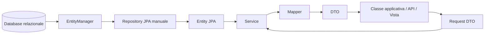

# UD30 - JPA/Hibernate, Entity, EntityManager e DTO

## Perché questa UD

Nelle UD precedenti abbiamo lavorato con JDBC, DAO, Service, DTO, API REST e mapper.
Abbiamo quindi già visto due idee fondamentali:

- il codice applicativo non dovrebbe accedere al database in modo disordinato;
- gli oggetti usati per comunicare con l'esterno non devono coincidere automaticamente con gli oggetti interni.

In questa UD introduciamo **JPA/Hibernate** per capire come cambia l'accesso ai dati quando non scriviamo manualmente ogni query JDBC e non trasformiamo a mano ogni `ResultSet` in oggetti Java.

La progressione della UD è questa:

```text
JDBC manuale
↓
problema del mapping oggetti/tabelle
↓
ORM
↓
JPA come specifica
↓
Hibernate come implementazione
↓
Entity JPA
↓
persistence unit
↓
EntityManager
↓
Repository JPA manuale
↓
Service, DTO e Mapper
```

Il punto centrale non è “non usare più SQL” e non è “dimenticare il database”.
Il punto è capire come un'applicazione Java può descrivere il collegamento tra classi e tabelle tramite entity e annotazioni.

---

## Obiettivi

Al termine della UD saremo in grado di:

1. spiegare il problema di mapping tra oggetti Java e database relazionale;
2. distinguere ORM, JPA e Hibernate;
3. distinguere entity, DTO, mapper, repository e service;
4. leggere e motivare le principali annotazioni JPA usate nel laboratorio;
5. configurare una persistence unit tramite `persistence.xml`;
6. usare `EntityManagerFactory`, `EntityManager` ed `EntityTransaction`;
7. creare repository JPA manuali;
8. usare DTO di richiesta e risposta senza esporre direttamente le entity;
9. preparare il passaggio a Spring Data JPA nella UD31.

---

## Distinzione fondamentale

```text
Database
contiene tabelle, colonne, chiavi primarie e chiavi esterne.

Entity JPA
rappresenta un oggetto Java persistente collegato a una tabella.

DTO
rappresenta dati usati in uno specifico caso d'uso, in input o in output.

Mapper
converte entity in DTO o costruisce DTO a partire da entity.

Repository
accede alla persistenza usando EntityManager.

Service
coordina il caso d'uso, applica regole e decide quali repository usare.
```

---

## Struttura della UD

| File | Contenuto |
|---|---|
| `01_ORM_foundations_impedance_mismatch_v2.md` | Dal JDBC all'ORM: perché nasce il problema oggetti/tabelle |
| `02_JPA_Hibernate_EntityManager_v2.md` | JPA, Hibernate, entity lifecycle, EntityManager e transazioni locali |
| `03_JPA_operativo_annotazioni_persistence_unit_v2.md` | Annotazioni JPA, `persistence.xml`, persistence unit e flusso operativo |
| `04_LAB30_guidato_mapping_corsi_jpa_dto_v2.md` | Laboratorio guidato completo con entity, repository JPA, service, DTO e mapper |
| `05_LAB30_autonomo_gestione_edizioni_jpa_dto_v2.md` | Laboratorio autonomo con vincoli, suggerimenti e criteri di completamento |

---

## Schema concettuale



---

## Ambiente previsto

Questa UD usa:

- JDK 17 o superiore;
- Maven;
- MariaDB/MySQL locale;
- Hibernate ORM;
- Jakarta Persistence;
- terminale Windows PowerShell, Linux o macOS.

Docker non è richiesto.

---

## Collegamento con UD31

Nella UD31 useremo Spring Boot e Spring Data JPA.

Spring Data JPA semplificherà molto il repository, ma non eliminerà i concetti imparati qui:

- le entity continueranno a rappresentare dati persistenti;
- i DTO continueranno a proteggere il confine applicativo;
- il service continuerà a contenere regole e casi d'uso;
- le annotazioni JPA continueranno a descrivere il mapping tra classi e tabelle.
