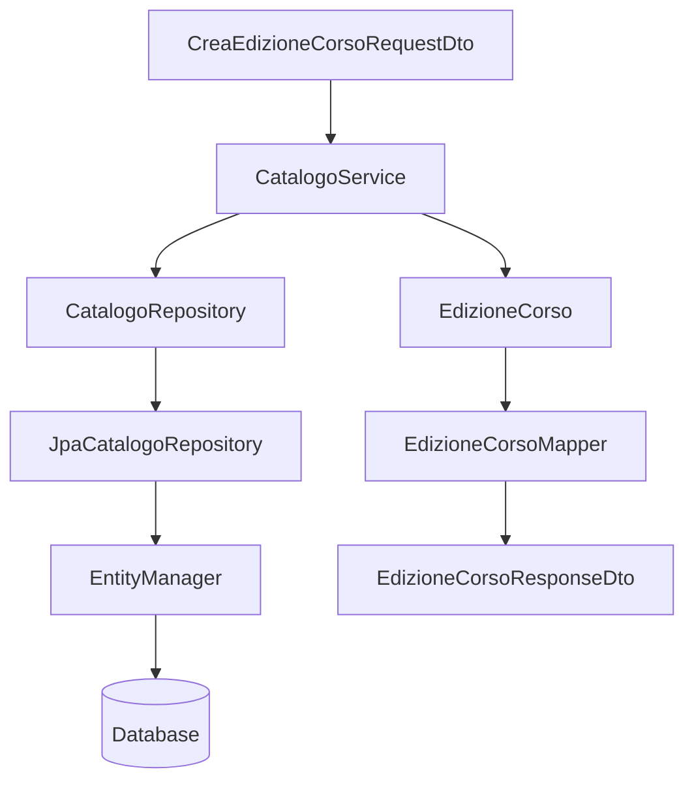

# LAB30 guidato - JPA, Entity, Repository manuale, DTO e Mapper

## Obiettivo

Realizziamo passo dopo passo una piccola applicazione Java con Maven, JPA/Hibernate e MariaDB/MySQL locale.

Il laboratorio mostra una catena completa:

```text
persistence.xml
↓
Entity JPA
↓
EntityManager
↓
Repository JPA manuale
↓
Service
↓
Mapper
↓
DTO
↓
Classe di avvio
```

Il punto non è soltanto far salvare dati nel database ma quello che abbiamo fatto durante il percorso: capire dove collocare le responsabilità:

| Livello | Responsabilità |
|---|---|
| Entity | rappresentare dati persistenti e relazioni |
| Repository | usare `EntityManager` per accedere ai dati |
| Service | applicare regole e coordinare il caso d'uso |
| Mapper | convertire entity in DTO |
| DTO | trasportare dati in input/output |
| App | creare gli oggetti e avviare la demo |

---

## Requisiti software

| Software | Uso nel laboratorio |
|---|---|
| JDK 17 o superiore | compilazione ed esecuzione |
| Maven | gestione dipendenze e avvio progetto |
| MariaDB/MySQL locale | database relazionale usato con utente `root` in ambiente didattico |
| Terminale | comandi di verifica |
| Editor Java | modifica sorgenti |


---

## Struttura finale del progetto

```text
UD30_lab_guidato_corsi_jpa_dto/
  pom.xml
  sql/
    00_reset_database.sql
  src/main/java/corso/ud30/guidato/
    app/
      EseguiDemoCorsiJpaDto.java
    config/
      JpaUtil.java
    dto/
      CorsoSintesiDto.java
      CreaEdizioneCorsoRequestDto.java
      EdizioneCorsoResponseDto.java
    mapper/
      CorsoMapper.java
      EdizioneCorsoMapper.java
    model/
      Corso.java
      EdizioneCorso.java
    repository/
      CatalogoRepository.java
    repository/jpa/
      JpaCatalogoRepository.java
    service/
      CatalogoService.java
  src/main/resources/META-INF/
    persistence.xml
  docs/
    evidence_UD30_guidato.md
```

Per mantenere il codice gestibile, usiamo due entity principali:

- `Corso`;
- `EdizioneCorso`.

Il laboratorio autonomo estenderà il modello includendo anche `Docente`.

---

# Passo 1 - Creare il progetto Maven

## Windows PowerShell

```powershell
New-Item -ItemType Directory -Force UD30_lab_guidato_corsi_jpa_dto
Set-Location UD30_lab_guidato_corsi_jpa_dto

New-Item -ItemType Directory -Force sql
New-Item -ItemType Directory -Force docs
New-Item -ItemType Directory -Force src/main/java/corso/ud30/guidato/app
New-Item -ItemType Directory -Force src/main/java/corso/ud30/guidato/config
New-Item -ItemType Directory -Force src/main/java/corso/ud30/guidato/dto
New-Item -ItemType Directory -Force src/main/java/corso/ud30/guidato/mapper
New-Item -ItemType Directory -Force src/main/java/corso/ud30/guidato/model
New-Item -ItemType Directory -Force src/main/java/corso/ud30/guidato/repository/jpa
New-Item -ItemType Directory -Force src/main/java/corso/ud30/guidato/service
New-Item -ItemType Directory -Force src/main/resources/META-INF
```

## Linux/macOS

```bash
mkdir -p UD30_lab_guidato_corsi_jpa_dto
cd UD30_lab_guidato_corsi_jpa_dto

mkdir -p sql docs
mkdir -p src/main/java/corso/ud30/guidato/app
mkdir -p src/main/java/corso/ud30/guidato/config
mkdir -p src/main/java/corso/ud30/guidato/dto
mkdir -p src/main/java/corso/ud30/guidato/mapper
mkdir -p src/main/java/corso/ud30/guidato/model
mkdir -p src/main/java/corso/ud30/guidato/repository/jpa
mkdir -p src/main/java/corso/ud30/guidato/service
mkdir -p src/main/resources/META-INF
```

---

# Passo 2 - Creare il `pom.xml`

Creare il file:

```text
pom.xml
```

Inserire:

```xml
<project xmlns="http://maven.apache.org/POM/4.0.0"
         xmlns:xsi="http://www.w3.org/2001/XMLSchema-instance"
         xsi:schemaLocation="http://maven.apache.org/POM/4.0.0 https://maven.apache.org/xsd/maven-4.0.0.xsd">

    <modelVersion>4.0.0</modelVersion>

    <groupId>corso.ud30</groupId>
    <artifactId>lab-guidato-corsi-jpa-dto</artifactId>
    <version>1.0.0</version>

    <properties>
        <maven.compiler.source>17</maven.compiler.source>
        <maven.compiler.target>17</maven.compiler.target>
        <project.build.sourceEncoding>UTF-8</project.build.sourceEncoding>
    </properties>

    <dependencies>
        <!-- Hibernate è il provider ORM che implementa Jakarta Persistence. -->
        <dependency>
            <groupId>org.hibernate.orm</groupId>
            <artifactId>hibernate-core</artifactId>
            <version>7.3.3.Final</version>
        </dependency>

        <!-- Driver JDBC necessario a Hibernate per comunicare con MariaDB/MySQL. -->
        <dependency>
            <groupId>org.mariadb.jdbc</groupId>
            <artifactId>mariadb-java-client</artifactId>
            <version>3.5.8</version>
        </dependency>

        <!-- Log minimale per visualizzare messaggi Hibernate in console. -->
        <dependency>
            <groupId>org.slf4j</groupId>
            <artifactId>slf4j-simple</artifactId>
            <version>2.0.17</version>
        </dependency>
    </dependencies>

    <build>
        <plugins>
            <plugin>
                <groupId>org.codehaus.mojo</groupId>
                <artifactId>exec-maven-plugin</artifactId>
                <version>3.3.0</version>
                <configuration>
                    <mainClass>corso.ud30.guidato.app.EseguiDemoCorsiJpaDto</mainClass>
                </configuration>
            </plugin>
        </plugins>
    </build>
</project>
```

## Spiegazione

| Dipendenza | Ruolo |
|---|---|
| `hibernate-core` | implementa JPA e gestisce il mapping ORM |
| `mariadb-java-client` | driver JDBC usato da Hibernate per collegarsi al database |
| `slf4j-simple` | permette di vedere log essenziali in console |

---

# Passo 3 - Preparare il database con utente `root`

In questo laboratorio usiamo una configurazione semplificata per ambiente locale: l'applicazione JPA/Hibernate si collega a MariaDB/MySQL con l'utente `root`.

Questa scelta serve a ridurre il numero di passaggi amministrativi nel laboratorio. In un ambiente reale o di produzione, un'applicazione non dovrebbe collegarsi al database con `root`, ma con un utente applicativo dedicato e con permessi limitati.

## Creare lo script SQL

Creare il file:

```text
sql/00_reset_database.sql
```

Inserire:

```sql
DROP DATABASE IF EXISTS academy_ud30_guidato;

CREATE DATABASE academy_ud30_guidato
CHARACTER SET utf8mb4
COLLATE utf8mb4_unicode_ci;

USE academy_ud30_guidato;
```

Lo script elimina l'eventuale database precedente, crea un nuovo database vuoto e lo seleziona come database corrente.

In questo laboratorio non creiamo utenti aggiuntivi e non eseguiamo comandi `GRANT`, perché useremo direttamente `root` nella configurazione JPA.

## Esecuzione Windows PowerShell con XAMPP

Verificare che MySQL/MariaDB sia avviato dal pannello di controllo di XAMPP.

Dalla cartella principale del progetto eseguire:

```powershell
C:\xampp\mysql\bin\mysql -u root < sql\00_reset_database.sql
```

Se l'utente `root` ha una password, usare invece:

```powershell
C:\xampp\mysql\bin\mysql -u root -p < sql\00_reset_database.sql
```

## Esecuzione Linux/macOS

```bash
mysql -u root -p < sql/00_reset_database.sql
```

## Verifica del database

Per verificare che il database sia stato creato:

```powershell
C:\xampp\mysql\bin\mysql -u root
```

Dentro MariaDB/MySQL eseguire:

```sql
SHOW DATABASES;
USE academy_ud30_guidato;
SHOW TABLES;
EXIT;
```

All'inizio `SHOW TABLES` può restituire un elenco vuoto. Le tabelle verranno create automaticamente da Hibernate al primo avvio dell'applicazione, grazie alla proprietà `hibernate.hbm2ddl.auto=update` configurata nel file `persistence.xml`.

---

# Passo 4 - Configurare `persistence.xml`

Creare il file:

```text
src/main/resources/META-INF/persistence.xml
```

Il file deve contenere solo XML. Non copiare nel file i delimitatori Markdown come ```xml o ```.

Inserire:

```xml
<persistence xmlns="https://jakarta.ee/xml/ns/persistence"
             xmlns:xsi="http://www.w3.org/2001/XMLSchema-instance"
             xsi:schemaLocation="https://jakarta.ee/xml/ns/persistence https://jakarta.ee/xml/ns/persistence/persistence_3_2.xsd"
             version="3.2">

    <persistence-unit name="academyGuidatoPU" transaction-type="RESOURCE_LOCAL">
        <provider>org.hibernate.jpa.HibernatePersistenceProvider</provider>

        <class>corso.ud30.guidato.model.Corso</class>
        <class>corso.ud30.guidato.model.EdizioneCorso</class>

        <properties>
            <property name="jakarta.persistence.jdbc.driver" value="org.mariadb.jdbc.Driver" />
            <property name="jakarta.persistence.jdbc.url" value="jdbc:mariadb://localhost:3306/academy_ud30_guidato" />
            <property name="jakarta.persistence.jdbc.user" value="root" />
            <property name="jakarta.persistence.jdbc.password" value="" />

            <property name="hibernate.hbm2ddl.auto" value="update" />
            <property name="hibernate.show_sql" value="true" />
            <property name="hibernate.format_sql" value="true" />
        </properties>
    </persistence-unit>
</persistence>
```

Se l'utente `root` ha una password, valorizzare la proprietà:

```xml
<property name="jakarta.persistence.jdbc.password" value="password_di_root" />
```

## Spiegazione

| Elemento | Significato |
|---|---|
| `academyGuidatoPU` | nome della persistence unit usata dal codice Java |
| `RESOURCE_LOCAL` | transazioni gestite localmente dall'applicazione |
| `provider` | indica Hibernate come implementazione JPA |
| `class` | dichiara le entity gestite dalla persistence unit |
| proprietà JDBC | indicano driver, URL, utente e password per collegarsi al database |
| `jakarta.persistence.jdbc.user=root` | usa l'utente amministrativo locale `root` per semplificare il laboratorio |
| `hibernate.hbm2ddl.auto=update` | consente a Hibernate di creare/aggiornare lo schema in laboratorio |
| `hibernate.show_sql=true` | mostra in console le query SQL generate da Hibernate |
| `hibernate.format_sql=true` | formatta le query SQL in modo più leggibile |

---
# Passo 5 - Creare l'entity `Corso`

Creare il file:

```text
src/main/java/corso/ud30/guidato/model/Corso.java
```

Inserire:

```java
package corso.ud30.guidato.model;

import jakarta.persistence.Column;
import jakarta.persistence.Entity;
import jakarta.persistence.GeneratedValue;
import jakarta.persistence.GenerationType;
import jakarta.persistence.Id;
import jakarta.persistence.Table;

@Entity
@Table(name = "corsi")
public class Corso {

    @Id
    @GeneratedValue(strategy = GenerationType.IDENTITY)
    private Long id;

    @Column(nullable = false, length = 120)
    private String titolo;

    @Column(nullable = false)
    private double prezzo;

    protected Corso() {
        // Costruttore richiesto da JPA.
    }

    public Corso(String titolo, double prezzo) {
        this.titolo = titolo;
        this.prezzo = prezzo;
    }

    public Long getId() {
        return id;
    }

    public String getTitolo() {
        return titolo;
    }

    public double getPrezzo() {
        return prezzo;
    }
}
```

## Spiegazione delle annotazioni usate

| Annotazione | Significato |
|---|---|
| `@Entity` | la classe è gestita da JPA |
| `@Table(name = "corsi")` | la classe corrisponde alla tabella `corsi` |
| `@Id` | il campo è la chiave primaria |
| `@GeneratedValue(strategy = GenerationType.IDENTITY)` | l'id viene generato dal database con auto-incremento |
| `@Column(nullable = false, length = 120)` | la colonna è obbligatoria e ha lunghezza massima 120 |

---

# Passo 6 - Creare l'entity `EdizioneCorso`

Creare il file:

```text
src/main/java/corso/ud30/guidato/model/EdizioneCorso.java
```

Inserire:

```java
package corso.ud30.guidato.model;

import jakarta.persistence.Column;
import jakarta.persistence.Entity;
import jakarta.persistence.GeneratedValue;
import jakarta.persistence.GenerationType;
import jakarta.persistence.Id;
import jakarta.persistence.JoinColumn;
import jakarta.persistence.ManyToOne;
import jakarta.persistence.Table;

import java.time.LocalDate;

@Entity
@Table(name = "edizioni_corso")
public class EdizioneCorso {

    @Id
    @GeneratedValue(strategy = GenerationType.IDENTITY)
    private Long id;

    @ManyToOne
    @JoinColumn(name = "corso_id", nullable = false)
    private Corso corso;

    @Column(name = "data_inizio", nullable = false)
    private LocalDate dataInizio;

    @Column(name = "data_fine", nullable = false)
    private LocalDate dataFine;

    @Column(name = "posti_massimi", nullable = false)
    private int postiMassimi;

    protected EdizioneCorso() {
        // Costruttore richiesto da JPA.
    }

    public EdizioneCorso(Corso corso, LocalDate dataInizio, LocalDate dataFine, int postiMassimi) {
        this.corso = corso;
        this.dataInizio = dataInizio;
        this.dataFine = dataFine;
        this.postiMassimi = postiMassimi;
    }

    public Long getId() {
        return id;
    }

    public Corso getCorso() {
        return corso;
    }

    public LocalDate getDataInizio() {
        return dataInizio;
    }

    public LocalDate getDataFine() {
        return dataFine;
    }

    public int getPostiMassimi() {
        return postiMassimi;
    }
}
```

## Spiegazione delle annotazioni nuove

| Annotazione | Significato |
|---|---|
| `@ManyToOne` | molte edizioni possono essere associate allo stesso corso |
| `@JoinColumn(name = "corso_id")` | la tabella `edizioni_corso` avrà una FK `corso_id` verso `corsi` |
| `@Column(name = "data_inizio")` | il campo Java `dataInizio` usa la colonna `data_inizio` |

---

# Passo 7 - Creare i DTO

## `CorsoSintesiDto`

Creare:

```text
src/main/java/corso/ud30/guidato/dto/CorsoSintesiDto.java
```

```java
package corso.ud30.guidato.dto;

public class CorsoSintesiDto {
    private final Long id;
    private final String titolo;
    private final double prezzo;

    public CorsoSintesiDto(Long id, String titolo, double prezzo) {
        this.id = id;
        this.titolo = titolo;
        this.prezzo = prezzo;
    }

    public Long getId() {
        return id;
    }

    public String getTitolo() {
        return titolo;
    }

    public double getPrezzo() {
        return prezzo;
    }

    @Override
    public String toString() {
        return "CorsoSintesiDto{" +
                "id=" + id +
                ", titolo='" + titolo + '\'' +
                ", prezzo=" + prezzo +
                '}';
    }
}
```

## `CreaEdizioneCorsoRequestDto`

Creare:

```text
src/main/java/corso/ud30/guidato/dto/CreaEdizioneCorsoRequestDto.java
```

```java
package corso.ud30.guidato.dto;

import java.time.LocalDate;

public class CreaEdizioneCorsoRequestDto {
    private final Long corsoId;
    private final LocalDate dataInizio;
    private final LocalDate dataFine;
    private final int postiMassimi;

    public CreaEdizioneCorsoRequestDto(Long corsoId, LocalDate dataInizio, LocalDate dataFine, int postiMassimi) {
        this.corsoId = corsoId;
        this.dataInizio = dataInizio;
        this.dataFine = dataFine;
        this.postiMassimi = postiMassimi;
    }

    public Long getCorsoId() {
        return corsoId;
    }

    public LocalDate getDataInizio() {
        return dataInizio;
    }

    public LocalDate getDataFine() {
        return dataFine;
    }

    public int getPostiMassimi() {
        return postiMassimi;
    }
}
```

## `EdizioneCorsoResponseDto`

Creare:

```text
src/main/java/corso/ud30/guidato/dto/EdizioneCorsoResponseDto.java
```

```java
package corso.ud30.guidato.dto;

import java.time.LocalDate;

public class EdizioneCorsoResponseDto {
    private final Long id;
    private final String titoloCorso;
    private final LocalDate dataInizio;
    private final LocalDate dataFine;
    private final int postiMassimi;

    public EdizioneCorsoResponseDto(Long id, String titoloCorso, LocalDate dataInizio, LocalDate dataFine, int postiMassimi) {
        this.id = id;
        this.titoloCorso = titoloCorso;
        this.dataInizio = dataInizio;
        this.dataFine = dataFine;
        this.postiMassimi = postiMassimi;
    }

    public Long getId() {
        return id;
    }

    public String getTitoloCorso() {
        return titoloCorso;
    }

    public LocalDate getDataInizio() {
        return dataInizio;
    }

    public LocalDate getDataFine() {
        return dataFine;
    }

    public int getPostiMassimi() {
        return postiMassimi;
    }

    @Override
    public String toString() {
        return "EdizioneCorsoResponseDto{" +
                "id=" + id +
                ", titoloCorso='" + titoloCorso + '\'' +
                ", dataInizio=" + dataInizio +
                ", dataFine=" + dataFine +
                ", postiMassimi=" + postiMassimi +
                '}';
    }
}
```

## Perché DTO separati

`CreaEdizioneCorsoRequestDto` contiene l'id del corso, perché in input il client o la classe applicativa non deve costruire direttamente l'entity `Corso`.

`EdizioneCorsoResponseDto` contiene `titoloCorso`, non l'intero oggetto `Corso`, perché in output vogliamo una forma semplice e leggibile.

---

# Passo 8 - Creare i mapper

## `CorsoMapper`

Creare:

```text
src/main/java/corso/ud30/guidato/mapper/CorsoMapper.java
```

```java
package corso.ud30.guidato.mapper;

import corso.ud30.guidato.dto.CorsoSintesiDto;
import corso.ud30.guidato.model.Corso;

public final class CorsoMapper {

    private CorsoMapper() {
    }

    public static CorsoSintesiDto toSintesiDto(Corso corso) {
        return new CorsoSintesiDto(
                corso.getId(),
                corso.getTitolo(),
                corso.getPrezzo()
        );
    }
}
```

## `EdizioneCorsoMapper`

Creare:

```text
src/main/java/corso/ud30/guidato/mapper/EdizioneCorsoMapper.java
```

```java
package corso.ud30.guidato.mapper;

import corso.ud30.guidato.dto.EdizioneCorsoResponseDto;
import corso.ud30.guidato.model.EdizioneCorso;

public final class EdizioneCorsoMapper {

    private EdizioneCorsoMapper() {
    }

    public static EdizioneCorsoResponseDto toResponseDto(EdizioneCorso edizione) {
        return new EdizioneCorsoResponseDto(
                edizione.getId(),
                edizione.getCorso().getTitolo(),
                edizione.getDataInizio(),
                edizione.getDataFine(),
                edizione.getPostiMassimi()
        );
    }
}
```

Il mapper non accede al database e non applica regole applicative. Traduce soltanto una forma in un'altra.

---

# Passo 9 - Creare `JpaUtil`

Creare:

```text
src/main/java/corso/ud30/guidato/config/JpaUtil.java
```

```java
package corso.ud30.guidato.config;

import jakarta.persistence.EntityManager;
import jakarta.persistence.EntityManagerFactory;
import jakarta.persistence.Persistence;

public final class JpaUtil {

    private static final EntityManagerFactory FACTORY =
            Persistence.createEntityManagerFactory("academyGuidatoPU");

    private JpaUtil() {
    }

    public static EntityManager createEntityManager() {
        return FACTORY.createEntityManager();
    }

    public static void close() {
        if (FACTORY.isOpen()) {
            FACTORY.close();
        }
    }
}
```

## Spiegazione

`JpaUtil` centralizza la creazione degli `EntityManager`.

| Elemento | Significato |
|---|---|
| `EntityManagerFactory` | oggetto pesante creato una sola volta |
| `createEntityManager()` | crea un `EntityManager` operativo |
| `close()` | chiude la factory a fine applicazione |

---

# Passo 10 - Creare il repository

## Interfaccia `CatalogoRepository`

Creare:

```text
src/main/java/corso/ud30/guidato/repository/CatalogoRepository.java
```

```java
package corso.ud30.guidato.repository;

import corso.ud30.guidato.model.Corso;
import corso.ud30.guidato.model.EdizioneCorso;

import java.util.List;
import java.util.Optional;

public interface CatalogoRepository {
    void seedIfEmpty();
    List<Corso> findAllCorsi();
    Optional<Corso> findCorsoById(Long id);
    EdizioneCorso saveEdizione(EdizioneCorso edizione);
    List<EdizioneCorso> findAllEdizioni();
}
```

## Implementazione `JpaCatalogoRepository`

Creare:

```text
src/main/java/corso/ud30/guidato/repository/jpa/JpaCatalogoRepository.java
```

```java
package corso.ud30.guidato.repository.jpa;

import corso.ud30.guidato.config.JpaUtil;
import corso.ud30.guidato.model.Corso;
import corso.ud30.guidato.model.EdizioneCorso;
import corso.ud30.guidato.repository.CatalogoRepository;
import jakarta.persistence.EntityManager;
import jakarta.persistence.EntityTransaction;

import java.util.List;
import java.util.Optional;

public class JpaCatalogoRepository implements CatalogoRepository {

    @Override
    public void seedIfEmpty() {
        EntityManager em = JpaUtil.createEntityManager();
        EntityTransaction tx = em.getTransaction();

        try {
            Long count = em.createQuery("select count(c) from Corso c", Long.class)
                    .getSingleResult();

            if (count > 0) {
                return;
            }

            tx.begin();
            em.persist(new Corso("Java Backend", 690.0));
            em.persist(new Corso("JPA e Hibernate", 790.0));
            tx.commit();
        } catch (RuntimeException ex) {
            if (tx.isActive()) {
                tx.rollback();
            }
            throw ex;
        } finally {
            em.close();
        }
    }

    @Override
    public List<Corso> findAllCorsi() {
        try (EntityManager em = JpaUtil.createEntityManager()) {
            return em.createQuery("select c from Corso c order by c.titolo", Corso.class)
                    .getResultList();
        }
    }

    @Override
    public Optional<Corso> findCorsoById(Long id) {
        try (EntityManager em = JpaUtil.createEntityManager()) {
            return Optional.ofNullable(em.find(Corso.class, id));
        }
    }

    @Override
    public EdizioneCorso saveEdizione(EdizioneCorso edizione) {
        EntityManager em = JpaUtil.createEntityManager();
        EntityTransaction tx = em.getTransaction();

        try {
            tx.begin();
            em.persist(edizione);
            tx.commit();
            return edizione;
        } catch (RuntimeException ex) {
            if (tx.isActive()) {
                tx.rollback();
            }
            throw ex;
        } finally {
            em.close();
        }
    }

    @Override
    public List<EdizioneCorso> findAllEdizioni() {
        try (EntityManager em = JpaUtil.createEntityManager()) {
            return em.createQuery(
                    "select e from EdizioneCorso e join fetch e.corso order by e.dataInizio",
                    EdizioneCorso.class
            ).getResultList();
        }
    }
}
```

## Spiegazione dei punti importanti

| Codice | Significato |
|---|---|
| `EntityManager em = JpaUtil.createEntityManager()` | apre un contesto JPA operativo |
| `em.find(Corso.class, id)` | cerca una entity per chiave primaria |
| `em.createQuery("select c from Corso c", Corso.class)` | esegue una query JPQL su entity, non direttamente su tabelle |
| `tx.begin()` | avvia una transazione locale |
| `em.persist(edizione)` | salva una nuova entity |
| `tx.commit()` | conferma la scrittura |
| `tx.rollback()` | annulla in caso di errore |
| `join fetch e.corso` | carica anche il corso collegato all'edizione |

---

# Passo 11 - Creare il service

Creare:

```text
src/main/java/corso/ud30/guidato/service/CatalogoService.java
```

```java
package corso.ud30.guidato.service;

import corso.ud30.guidato.dto.CorsoSintesiDto;
import corso.ud30.guidato.dto.CreaEdizioneCorsoRequestDto;
import corso.ud30.guidato.dto.EdizioneCorsoResponseDto;
import corso.ud30.guidato.mapper.CorsoMapper;
import corso.ud30.guidato.mapper.EdizioneCorsoMapper;
import corso.ud30.guidato.model.Corso;
import corso.ud30.guidato.model.EdizioneCorso;
import corso.ud30.guidato.repository.CatalogoRepository;

import java.time.LocalDate;
import java.util.List;

public class CatalogoService {

    private final CatalogoRepository repository;

    public CatalogoService(CatalogoRepository repository) {
        this.repository = repository;
    }

    public void preparaDatiDemo() {
        repository.seedIfEmpty();
    }

    public List<CorsoSintesiDto> elencaCorsi() {
        return repository.findAllCorsi()
                .stream()
                .map(CorsoMapper::toSintesiDto)
                .toList();
    }

    public EdizioneCorsoResponseDto creaEdizione(CreaEdizioneCorsoRequestDto request) {
        validaRequest(request);

        Corso corso = repository.findCorsoById(request.getCorsoId())
                .orElseThrow(() -> new IllegalArgumentException("Corso non trovato: " + request.getCorsoId()));

        EdizioneCorso edizione = new EdizioneCorso(
                corso,
                request.getDataInizio(),
                request.getDataFine(),
                request.getPostiMassimi()
        );

        EdizioneCorso salvata = repository.saveEdizione(edizione);
        return EdizioneCorsoMapper.toResponseDto(salvata);
    }

    public List<EdizioneCorsoResponseDto> elencaEdizioni() {
        return repository.findAllEdizioni()
                .stream()
                .map(EdizioneCorsoMapper::toResponseDto)
                .toList();
    }

    private void validaRequest(CreaEdizioneCorsoRequestDto request) {
        if (request == null) {
            throw new IllegalArgumentException("Request obbligatoria");
        }
        if (request.getCorsoId() == null) {
            throw new IllegalArgumentException("corsoId obbligatorio");
        }
        LocalDate dataInizio = request.getDataInizio();
        LocalDate dataFine = request.getDataFine();
        if (dataInizio == null || dataFine == null) {
            throw new IllegalArgumentException("Date obbligatorie");
        }
        if (dataFine.isBefore(dataInizio)) {
            throw new IllegalArgumentException("La data fine non può precedere la data inizio");
        }
        if (request.getPostiMassimi() <= 0) {
            throw new IllegalArgumentException("I posti massimi devono essere maggiori di zero");
        }
    }
}
```

## Spiegazione

Il service:

- riceve un request DTO;
- valida i dati;
- carica le entity necessarie;
- crea una nuova entity;
- chiama il repository;
- restituisce un response DTO.

Il service non usa `EntityManager` direttamente.

---

# Passo 12 - Creare la classe di avvio

Creare:

```text
src/main/java/corso/ud30/guidato/app/EseguiDemoCorsiJpaDto.java
```

```java
package corso.ud30.guidato.app;

import corso.ud30.guidato.config.JpaUtil;
import corso.ud30.guidato.dto.CreaEdizioneCorsoRequestDto;
import corso.ud30.guidato.dto.EdizioneCorsoResponseDto;
import corso.ud30.guidato.repository.CatalogoRepository;
import corso.ud30.guidato.repository.jpa.JpaCatalogoRepository;
import corso.ud30.guidato.service.CatalogoService;

import java.time.LocalDate;

public class EseguiDemoCorsiJpaDto {

    public static void main(String[] args) {
        CatalogoRepository repository = new JpaCatalogoRepository();
        CatalogoService service = new CatalogoService(repository);

        try {
            service.preparaDatiDemo();

            System.out.println("=== CORSI DISPONIBILI ===");
            service.elencaCorsi().forEach(System.out::println);

            CreaEdizioneCorsoRequestDto request = new CreaEdizioneCorsoRequestDto(
                    1L,
                    LocalDate.of(2026, 6, 15),
                    LocalDate.of(2026, 6, 19),
                    18
            );

            EdizioneCorsoResponseDto creata = service.creaEdizione(request);
            System.out.println("\n=== EDIZIONE CREATA ===");
            System.out.println(creata);

            System.out.println("\n=== ELENCO EDIZIONI ===");
            service.elencaEdizioni().forEach(System.out::println);

        } finally {
            JpaUtil.close();
        }
    }
}
```

## Spiegazione

La classe di avvio crea e collega i componenti.

```text
EseguiDemoCorsiJpaDto
↓
CatalogoService
↓
CatalogoRepository
↓
JpaCatalogoRepository
↓
EntityManager
```

La classe di avvio non contiene query e non usa direttamente JPA.

---

# Passo 13 - Compilare ed eseguire

```bash
mvn clean compile
mvn exec:java
```

Risultato atteso:

```text
=== CORSI DISPONIBILI ===
CorsoSintesiDto{id=1, titolo='Java Backend', prezzo=690.0}
CorsoSintesiDto{id=2, titolo='JPA e Hibernate', prezzo=790.0}

=== EDIZIONE CREATA ===
EdizioneCorsoResponseDto{id=1, titoloCorso='Java Backend', dataInizio=2026-06-15, dataFine=2026-06-19, postiMassimi=18}

=== ELENCO EDIZIONI ===
EdizioneCorsoResponseDto{...}
```

Hibernate mostrerà anche SQL generato, perché in `persistence.xml` abbiamo impostato:

```xml
<property name="hibernate.show_sql" value="true" />
```

---

Il progetto che abbiamo compilato ed eseguito è diverso da una API REST.
Il risultato è una applicazione Java standalone, eseguita tramite una classe `main`, che usa JPA/Hibernate per accedere al database.
Non sono presenti endpoint HTTP, controller web o risposte JSON verso un client.
L’obiettivo è stato quello di comprendere il funzionamento della persistenza JPA/Hibernate: entity, annotazioni, persistence unit, `EntityManager`, repository JPA manuale, service, DTO e mapper.

La trasformazione di questa logica in una vera applicazione web/API verrà ripresa nella UD31 con Spring Boot.


# Passo 14 - Evidenze richieste

Creare:

```text
docs/evidence_UD30_guidato.md
```

Inserire:

1. struttura finale del progetto;
2. contenuto essenziale del `persistence.xml`;
3. output di `mvn clean compile`;
4. output di `mvn exec:java`;
5. spiegazione delle annotazioni `@Entity`, `@Table`, `@Id`, `@GeneratedValue`, `@Column`, `@ManyToOne`, `@JoinColumn`;
6. spiegazione della differenza tra entity e DTO;
7. schema del flusso request DTO → service → entity → repository → response DTO;
8. risposta alla domanda: perché il service non deve usare direttamente `EntityManager`?

---

## Schema Mermaid per l'evidence


