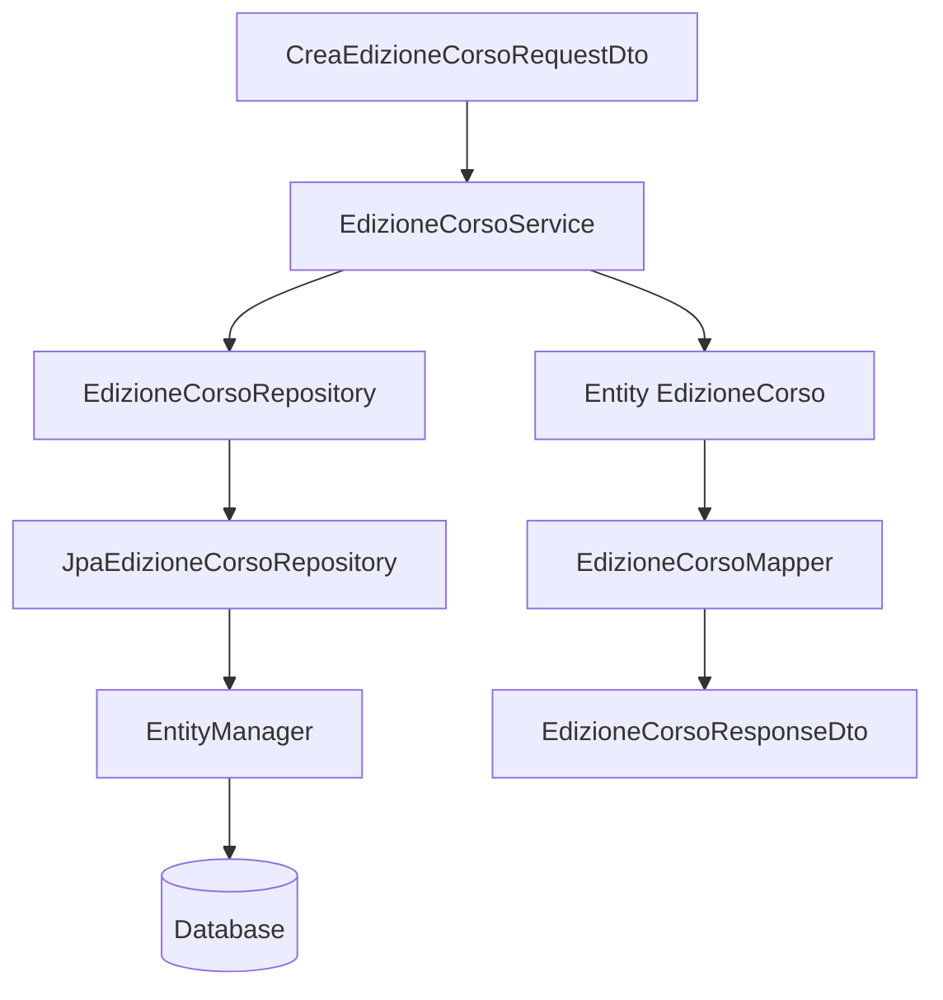

# LAB30 autonomo - Gestione edizioni corso con JPA, DTO e repository manuale

## Scenario

Una academy deve gestire corsi, docenti ed edizioni corso.

Il database conserva i dati persistenti.
L'applicazione Java lavora con entity JPA.
La comunicazione applicativa verso l'esterno avviene tramite DTO.

In questo laboratorio applichiamo in autonomia quanto visto nel guidato, ampliando il modello con tre entity:

- `Corso`;
- `Docente`;
- `EdizioneCorso`.

Il laboratorio non introduce Spring. Useremo JPA/Hibernate con `EntityManager` e repository manuale.

---

## Obiettivo

Realizzare una soluzione Java con Maven, JPA/Hibernate e MariaDB/MySQL locale che permetta di:

1. preparare dati iniziali di corsi e docenti;
2. leggere corsi e docenti in forma DTO;
3. creare una nuova edizione corso a partire da un request DTO;
4. elencare le edizioni in forma DTO sintetica;
5. mostrare il dettaglio di una edizione in forma DTO;
6. applicare regole di validazione nel service;
7. mantenere separate entity, DTO, mapper, repository e service.

---

## Cosa deve essere autonomo

Questo laboratorio è autonomo, ma non è un salto nel vuoto. Le scelte architetturali principali sono già state viste nel guidato.

Da svolgere in autonomia:

| Area | Attività |
|---|---|
| Entity | completare `Corso`, `Docente`, `EdizioneCorso`, `StatoEdizione` |
| DTO | creare request DTO e response DTO richiesti |
| Mapper | convertire entity in DTO |
| Repository | implementare i metodi con `EntityManager` |
| Service | applicare validazioni e coordinare repository/mapper |
| Demo | mostrare il flusso applicativo completo |
| Evidence | spiegare le scelte, non solo incollare output |

---

## Struttura richiesta

```text
UD30_gestione_edizioni_jpa_dto/
  pom.xml
  sql/
    00_reset_database.sql
  src/main/java/corso/ud30/academy/
    app/
      EseguiDemoEdizioniJpaDto.java
    config/
      JpaUtil.java
    dto/
      CorsoSintesiDto.java
      DocenteSintesiDto.java
      CreaEdizioneCorsoRequestDto.java
      EdizioneCorsoResponseDto.java
      EdizioneCorsoDettaglioDto.java
    mapper/
      CorsoMapper.java
      DocenteMapper.java
      EdizioneCorsoMapper.java
    model/
      Corso.java
      Docente.java
      EdizioneCorso.java
      StatoEdizione.java
    repository/
      EdizioneCorsoRepository.java
    repository/jpa/
      JpaEdizioneCorsoRepository.java
    service/
      EdizioneCorsoService.java
  src/main/resources/META-INF/
    persistence.xml
  docs/
    evidence_UD30_autonomo.md
```

---

# 1. Database

Creare il file:

```text
sql/00_reset_database.sql
```

Contenuto:

```sql
DROP DATABASE IF EXISTS academy_ud30;
CREATE DATABASE academy_ud30 CHARACTER SET utf8mb4 COLLATE utf8mb4_unicode_ci;

CREATE USER IF NOT EXISTS 'academy_user'@'localhost' IDENTIFIED BY 'academy_pwd';
GRANT ALL PRIVILEGES ON academy_ud30.* TO 'academy_user'@'localhost';
FLUSH PRIVILEGES;

USE academy_ud30;
```

## Windows PowerShell

```powershell
mysql -u root -p < sql\00_reset_database.sql
```

## Linux/macOS

```bash
mysql -u root -p < sql/00_reset_database.sql
```

Le tabelle possono essere create da Hibernate tramite le entity, usando `hibernate.hbm2ddl.auto=update`.

---

# 2. Entity richieste

Creare almeno queste entity:

| Entity | Responsabilità |
|---|---|
| `Corso` | rappresenta un corso persistente |
| `Docente` | rappresenta un docente persistente |
| `EdizioneCorso` | rappresenta una edizione collegata a corso e docente |
| `StatoEdizione` | enum con stato dell'edizione |

## Annotazioni minime richieste

| Annotazione | Dove usarla |
|---|---|
| `@Entity` | su `Corso`, `Docente`, `EdizioneCorso` |
| `@Table` | per indicare il nome delle tabelle |
| `@Id` | sulla chiave primaria |
| `@GeneratedValue(strategy = GenerationType.IDENTITY)` | sull'id generato dal database |
| `@Column` | sui campi semplici con vincoli |
| `@ManyToOne` | da `EdizioneCorso` verso `Corso` e `Docente` |
| `@JoinColumn` | per indicare `corso_id` e `docente_id` |
| `@Enumerated(EnumType.STRING)` | sullo stato dell'edizione |

---

## Suggerimento per `StatoEdizione`

```java
package corso.ud30.academy.model;

public enum StatoEdizione {
    PIANIFICATA,
    ATTIVA,
    CHIUSA
}
```

---

## Suggerimento per `EdizioneCorso`

Non viene fornita l'intera classe completa, ma la struttura deve contenere almeno:

```java
@Entity
@Table(name = "edizioni_corso")
public class EdizioneCorso {

    @Id
    @GeneratedValue(strategy = GenerationType.IDENTITY)
    private Long id;

    @ManyToOne
    @JoinColumn(name = "corso_id", nullable = false)
    private Corso corso;

    @ManyToOne
    @JoinColumn(name = "docente_id", nullable = false)
    private Docente docente;

    @Column(name = "data_inizio", nullable = false)
    private LocalDate dataInizio;

    @Column(name = "data_fine", nullable = false)
    private LocalDate dataFine;

    @Column(name = "posti_massimi", nullable = false)
    private int postiMassimi;

    @Column(name = "posti_occupati", nullable = false)
    private int postiOccupati;

    @Enumerated(EnumType.STRING)
    @Column(nullable = false, length = 30)
    private StatoEdizione stato;

    protected EdizioneCorso() {
        // Costruttore richiesto da JPA.
    }
}
```

Completare:

- costruttore applicativo;
- getter;
- eventuale metodo `getPostiDisponibili()`;
- inizializzazione dello stato a `PIANIFICATA`.

---

# 3. DTO richiesti

Creare almeno:

| DTO | Uso |
|---|---|
| `CreaEdizioneCorsoRequestDto` | input per creare una edizione |
| `EdizioneCorsoResponseDto` | output sintetico dopo creazione o elenco |
| `EdizioneCorsoDettaglioDto` | output dettagliato di una edizione |
| `CorsoSintesiDto` | elenco corsi disponibili |
| `DocenteSintesiDto` | elenco docenti disponibili |

## Indicazioni

`CreaEdizioneCorsoRequestDto` deve contenere identificativi, non entity:

```java
private final Long corsoId;
private final Long docenteId;
private final LocalDate dataInizio;
private final LocalDate dataFine;
private final int postiMassimi;
```

Questo è importante: il request DTO rappresenta una richiesta applicativa, non una riga del database.

`EdizioneCorsoResponseDto` può contenere dati già leggibili:

```java
private final Long id;
private final String titoloCorso;
private final String nomeDocente;
private final LocalDate dataInizio;
private final LocalDate dataFine;
private final int postiMassimi;
private final String stato;
```

---

# 4. Mapper richiesti

Creare mapper manuali:

- `CorsoMapper`;
- `DocenteMapper`;
- `EdizioneCorsoMapper`.

I mapper:

- ricevono entity;
- restituiscono DTO;
- non interrogano il database;
- non applicano validazioni di business;
- non usano `EntityManager`.

Esempio:

```java
public final class EdizioneCorsoMapper {

    private EdizioneCorsoMapper() {
    }

    public static EdizioneCorsoResponseDto toResponseDto(EdizioneCorso edizione) {
        return new EdizioneCorsoResponseDto(
                edizione.getId(),
                edizione.getCorso().getTitolo(),
                edizione.getDocente().getNomeCompleto(),
                edizione.getDataInizio(),
                edizione.getDataFine(),
                edizione.getPostiMassimi(),
                edizione.getStato().name()
        );
    }
}
```

---

# 5. Repository richiesto

Creare l'interfaccia:

```text
src/main/java/corso/ud30/academy/repository/EdizioneCorsoRepository.java
```

Metodi minimi:

```java
List<Corso> findAllCorsi();
List<Docente> findAllDocenti();
Optional<Corso> findCorsoById(Long id);
Optional<Docente> findDocenteById(Long id);
EdizioneCorso saveEdizione(EdizioneCorso edizione);
Optional<EdizioneCorso> findEdizioneById(Long id);
List<EdizioneCorso> findAllEdizioni();
void seedIfEmpty();
```

Creare poi l'implementazione:

```text
src/main/java/corso/ud30/academy/repository/jpa/JpaEdizioneCorsoRepository.java
```

## Regole per l'implementazione JPA

- usare `EntityManager` solo nel repository;
- usare transazione locale per `persist` e per il seed;
- usare `try-with-resources` dove possibile con `EntityManager`;
- usare `EntityTransaction` quando si scrive;
- usare JPQL per gli elenchi;
- usare `join fetch` quando il DTO ha bisogno di dati collegati.

Esempio di lettura:

```java
@Override
public List<EdizioneCorso> findAllEdizioni() {
    try (EntityManager em = JpaUtil.createEntityManager()) {
        return em.createQuery(
                "select e from EdizioneCorso e " +
                "join fetch e.corso " +
                "join fetch e.docente " +
                "order by e.dataInizio",
                EdizioneCorso.class
        ).getResultList();
    }
}
```

Esempio di scrittura:

```java
@Override
public EdizioneCorso saveEdizione(EdizioneCorso edizione) {
    EntityManager em = JpaUtil.createEntityManager();
    EntityTransaction tx = em.getTransaction();

    try {
        tx.begin();
        em.persist(edizione);
        tx.commit();
        return edizione;
    } catch (RuntimeException ex) {
        if (tx.isActive()) {
            tx.rollback();
        }
        throw ex;
    } finally {
        em.close();
    }
}
```

---

# 6. Service richiesto

Creare:

```text
src/main/java/corso/ud30/academy/service/EdizioneCorsoService.java
```

Il service deve:

1. ricevere `CreaEdizioneCorsoRequestDto`;
2. validare date e posti;
3. caricare `Corso` e `Docente` dal repository;
4. creare una entity `EdizioneCorso`;
5. salvare tramite repository;
6. restituire DTO;
7. non esporre entity verso la classe applicativa.

## Validazioni minime

| Regola | Dove va |
|---|---|
| `request` non nulla | service |
| `corsoId` obbligatorio | service |
| `docenteId` obbligatorio | service |
| date obbligatorie | service |
| data fine non precedente a data inizio | service |
| posti massimi maggiori di zero | service |
| corso inesistente | service, usando repository |
| docente inesistente | service, usando repository |

---

# 7. Classe di avvio

Creare:

```text
src/main/java/corso/ud30/academy/app/EseguiDemoEdizioniJpaDto.java
```

La demo deve mostrare almeno:

1. preparazione dati iniziali;
2. elenco corsi disponibili in DTO;
3. elenco docenti disponibili in DTO;
4. creazione di una nuova edizione;
5. elenco edizioni;
6. dettaglio di una edizione;
7. chiusura di `JpaUtil` nel `finally`.

Schema atteso:

```java
EdizioneCorsoRepository repository = new JpaEdizioneCorsoRepository();
EdizioneCorsoService service = new EdizioneCorsoService(repository);

try {
    service.preparaDatiDemo();

    service.elencaCorsi().forEach(System.out::println);
    service.elencaDocenti().forEach(System.out::println);

    CreaEdizioneCorsoRequestDto request = new CreaEdizioneCorsoRequestDto(...);
    EdizioneCorsoResponseDto creata = service.creaEdizione(request);

    service.elencaEdizioni().forEach(System.out::println);
    System.out.println(service.dettaglioEdizione(creata.getId()));
} finally {
    JpaUtil.close();
}
```

---

# 8. Comandi di verifica

```bash
mvn clean compile
mvn exec:java -Dexec.mainClass=corso.ud30.academy.app.EseguiDemoEdizioniJpaDto
```

Gli stessi comandi Maven sono validi su Windows PowerShell, Linux e macOS.

---

# 9. Casi anomali da verificare

Verificare almeno due casi anomali:

| Caso | Esito atteso |
|---|---|
| `corsoId` inesistente | errore applicativo gestito |
| `docenteId` inesistente | errore applicativo gestito |
| data fine precedente a data inizio | errore applicativo gestito |
| posti massimi uguali a zero | errore applicativo gestito |

Questi controlli devono stare nel service, non nel repository.

---

# 10. Evidenze richieste

Nel file:

```text
docs/evidence_UD30_autonomo.md
```

documentare:

1. struttura dei package;
2. contenuto essenziale di `persistence.xml`;
3. output dello script SQL;
4. output di `mvn clean compile`;
5. output della demo;
6. elenco entity create;
7. elenco DTO creati;
8. elenco mapper creati;
9. elenco metodi repository implementati;
10. spiegazione della differenza tra entity e DTO;
11. schema Mermaid del flusso applicativo;
12. risultati di almeno due casi anomali;
13. risposta alla domanda: perché `EdizioneCorsoDettaglioDto` non coincide con la tabella `edizioni_corso`?

---

## Schema Mermaid da inserire nelle evidenze



---

# 11. Domande di riflessione

1. Perché `CreaEdizioneCorsoRequestDto` contiene `corsoId` e `docenteId`, mentre l'entity contiene `Corso` e `Docente`?
2. Perché `EdizioneCorsoResponseDto` contiene `titoloCorso` e `nomeDocente` invece di contenere direttamente oggetti `Corso` e `Docente`?
3. Perché il repository deve usare `EntityManager`, mentre il service no?
4. Che differenza c'è tra una query SQL e una query JPQL?
5. Perché il mapper non deve interrogare il database?
6. Quale vantaggio avremo in UD31 quando Spring Data JPA sostituirà il repository manuale?
7. Perché una entity JPA non dovrebbe essere usata automaticamente come DTO di risposta?
8. Perché le validazioni applicative devono stare nel service?

---

# 12. Criteri di completamento

Il laboratorio è completo quando:

- il progetto Maven compila;
- il database viene preparato correttamente;
- le entity sono annotate in modo coerente;
- `persistence.xml` contiene le entity e i parametri corretti;
- il repository usa `EntityManager`;
- il service non usa direttamente `EntityManager`;
- i DTO non coincidono automaticamente con le entity;
- i mapper sono separati;
- la demo mostra dati in output;
- l'evidence spiega le responsabilità dei livelli.
