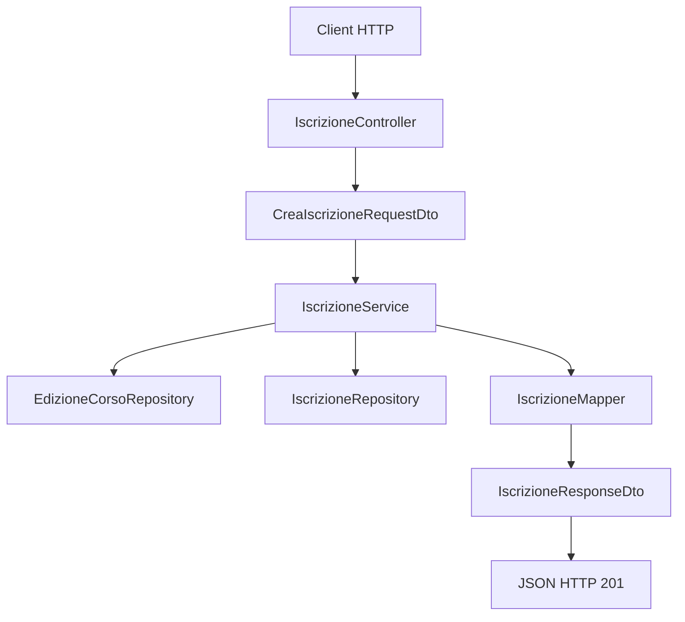

# LAB31 guidato - API Academy con Spring Boot, DTO, Spring Data JPA e transazioni

## Scenario

In questo laboratorio realizziamo una API Spring Boot per gestire corsi, edizioni e iscrizioni di una academy.

Il progetto riprende i concetti già visti:

- DTO e JSON dalla UD29;
- entity JPA, repository e persistenza dalla UD30;
- transazioni manuali da UD25 e UD30;
- separazione tra controller, service, repository, mapper e DTO.

Con Spring Boot vediamo come questi concetti vengono integrati in un'unica applicazione REST.

---

## Obiettivi del laboratorio

Al termine del laboratorio avremo realizzato:

- una applicazione Spring Boot;
- entity JPA persistite su MariaDB/MySQL;
- repository Spring Data JPA;
- service con regole applicative;
- mapper entity → DTO;
- controller REST;
- endpoint `GET` e `POST`;
- transazione dichiarativa con `@Transactional`;
- gestione errori con `@RestControllerAdvice`.

---

## Endpoint previsti

| Metodo | Endpoint | Descrizione |
|---|---|---|
| `GET` | `/api/corsi` | elenco dei corsi pubblicabili |
| `GET` | `/api/edizioni` | elenco delle edizioni disponibili |
| `GET` | `/api/iscrizioni` | elenco delle iscrizioni create |
| `POST` | `/api/iscrizioni` | creazione di una nuova iscrizione |

---

## Struttura del progetto

```text
UD31_academy_spring_boot/
  pom.xml
  src/main/java/corso/ud31/academy/
    AcademyApplication.java
    controller/
    dto/
    entity/
    exception/
    mapper/
    repository/
    service/
    config/
  src/main/resources/
    application.properties
  docs/
```

---

# 1. Creare il progetto Maven Spring Boot

Creare la cartella del progetto:

```bash
mkdir UD31_academy_spring_boot
cd UD31_academy_spring_boot
```

Creare la struttura:

### Linux/macOS

```bash
mkdir -p src/main/java/corso/ud31/academy/{controller,dto,entity,exception,mapper,repository,service,config}
mkdir -p src/main/resources
mkdir -p docs
```

### Windows PowerShell

```powershell
New-Item -ItemType Directory -Force src/main/java/corso/ud31/academy/controller
New-Item -ItemType Directory -Force src/main/java/corso/ud31/academy/dto
New-Item -ItemType Directory -Force src/main/java/corso/ud31/academy/entity
New-Item -ItemType Directory -Force src/main/java/corso/ud31/academy/exception
New-Item -ItemType Directory -Force src/main/java/corso/ud31/academy/mapper
New-Item -ItemType Directory -Force src/main/java/corso/ud31/academy/repository
New-Item -ItemType Directory -Force src/main/java/corso/ud31/academy/service
New-Item -ItemType Directory -Force src/main/java/corso/ud31/academy/config
New-Item -ItemType Directory -Force src/main/resources
New-Item -ItemType Directory -Force docs
```

---

# 2. Creare il `pom.xml`

Creare il file:

```text
pom.xml
```

Inserire:

```xml
<project xmlns="http://maven.apache.org/POM/4.0.0"
         xmlns:xsi="http://www.w3.org/2001/XMLSchema-instance"
         xsi:schemaLocation="http://maven.apache.org/POM/4.0.0 https://maven.apache.org/xsd/maven-4.0.0.xsd">

    <modelVersion>4.0.0</modelVersion>

    <parent>
        <groupId>org.springframework.boot</groupId>
        <artifactId>spring-boot-starter-parent</artifactId>
        <version>3.3.5</version>
        <relativePath/>
    </parent>

    <groupId>corso.ud31</groupId>
    <artifactId>academy-spring-boot</artifactId>
    <version>1.0.0</version>

    <properties>
        <java.version>17</java.version>
    </properties>

    <dependencies>
        <dependency>
            <groupId>org.springframework.boot</groupId>
            <artifactId>spring-boot-starter-web</artifactId>
        </dependency>

        <dependency>
            <groupId>org.springframework.boot</groupId>
            <artifactId>spring-boot-starter-data-jpa</artifactId>
        </dependency>

        <dependency>
            <groupId>org.mariadb.jdbc</groupId>
            <artifactId>mariadb-java-client</artifactId>
            <scope>runtime</scope>
        </dependency>
    </dependencies>

    <build>
        <plugins>
            <plugin>
                <groupId>org.springframework.boot</groupId>
                <artifactId>spring-boot-maven-plugin</artifactId>
            </plugin>
        </plugins>
    </build>
</project>
```

### Spiegazione essenziale

| Dipendenza | Funzione |
|---|---|
| `spring-boot-starter-web` | controller REST, server web embedded, Jackson |
| `spring-boot-starter-data-jpa` | Spring Data JPA, JPA, Hibernate |
| `mariadb-java-client` | driver JDBC per MariaDB/MySQL |

---

# 3. Configurare il database

Creare il file:

```text
src/main/resources/application.properties
```

Inserire:

```properties
spring.application.name=academy-spring-boot

spring.datasource.url=jdbc:mariadb://localhost:3306/academy_ud31_guidato
spring.datasource.username=root
spring.datasource.password=
spring.datasource.driver-class-name=org.mariadb.jdbc.Driver

spring.jpa.hibernate.ddl-auto=update
spring.jpa.show-sql=true
spring.jpa.properties.hibernate.format_sql=true

server.port=8080
```

### Nota

`application.properties` sostituisce il ruolo che in UD30 era svolto da `persistence.xml`.

In UD30 configuravamo manualmente la persistence unit.

In UD31 Spring Boot legge queste proprietà e configura datasource, JPA e Hibernate.

---

# 4. Script SQL iniziale

Creare il database da terminale o da phpMyAdmin.

In questo laboratorio viene usata l'autenticazione diretta con l'utente amministrativo locale `root` e password vuota, coerentemente con la configurazione XAMPP/MariaDB usata in aula.

Lo script non crea utenti applicativi dedicati e non esegue istruzioni `GRANT`.

```sql
DROP DATABASE IF EXISTS academy_ud31_guidato;

CREATE DATABASE academy_ud31_guidato
CHARACTER SET utf8mb4
COLLATE utf8mb4_unicode_ci;

USE academy_ud31_guidato;
```

La configurazione nel file `application.properties` deve quindi usare:

```properties
spring.datasource.username=root
spring.datasource.password=
```

Questa scelta semplifica l'esecuzione del laboratorio in ambiente locale. In un ambiente reale, invece, è preferibile usare un utente applicativo dedicato con privilegi limitati al solo database necessario.

---

# 5. Creare la classe principale

Creare il file:

```text
src/main/java/corso/ud31/academy/AcademyApplication.java
```

Inserire:

```java
package corso.ud31.academy;

import org.springframework.boot.SpringApplication;
import org.springframework.boot.autoconfigure.SpringBootApplication;

@SpringBootApplication
public class AcademyApplication {

    public static void main(String[] args) {
        SpringApplication.run(AcademyApplication.class, args);
    }
}
```

### Spiegazione

`@SpringBootApplication` indica il punto di avvio dell'applicazione Spring Boot.

`SpringApplication.run(...)` avvia:

- il container Spring;
- il server web embedded;
- la configurazione automatica;
- la scansione dei componenti presenti nel package `corso.ud31.academy` e nei sotto-package.

---

# 6. Creare le entity


Da questo punto in poi, quando introduciamo una nuova classe, aggiungiamo solo le informazioni operative necessarie per capire il ruolo della classe nel flusso dell'applicazione. L'obiettivo è riconoscere responsabilità, annotazioni principali e metodi essenziali, senza trasformare il laboratorio in una trattazione teorica estesa.

## 6.1 `Corso`

Creare:

```text
src/main/java/corso/ud31/academy/entity/Corso.java
```

```java
package corso.ud31.academy.entity;

import jakarta.persistence.Entity;
import jakarta.persistence.GeneratedValue;
import jakarta.persistence.GenerationType;
import jakarta.persistence.Id;
import jakarta.persistence.Table;

@Entity
@Table(name = "corsi")
public class Corso {

    @Id
    @GeneratedValue(strategy = GenerationType.IDENTITY)
    private Long id;

    private String titolo;
    private String descrizione;
    private boolean pubblicabile;

    protected Corso() {
        // Costruttore richiesto da JPA.
    }

    public Corso(String titolo, String descrizione, boolean pubblicabile) {
        this.titolo = titolo;
        this.descrizione = descrizione;
        this.pubblicabile = pubblicabile;
    }

    public Long getId() {
        return id;
    }

    public String getTitolo() {
        return titolo;
    }

    public String getDescrizione() {
        return descrizione;
    }

    public boolean isPubblicabile() {
        return pubblicabile;
    }
}
```

**Spiegazione essenziale**

`Corso` è una entity JPA: rappresenta la tabella `corsi` e contiene i dati persistenti del corso.

- `@Entity` rende la classe gestibile da JPA/Hibernate.
- `@Table(name = "corsi")` collega la classe alla tabella `corsi`.
- `@Id` identifica la chiave primaria.
- `@GeneratedValue(strategy = GenerationType.IDENTITY)` delega al database la generazione dell'id.
- Il costruttore `protected Corso()` serve a JPA per creare gli oggetti quando legge i dati dal database.
- Il costruttore pubblico viene usato dal nostro codice quando creiamo nuovi corsi.


---

## 6.2 `StatoEdizione`

Creare:

```text
src/main/java/corso/ud31/academy/entity/StatoEdizione.java
```

```java
package corso.ud31.academy.entity;

public enum StatoEdizione {
    APERTA,
    CHIUSA
}
```

**Spiegazione essenziale**

`StatoEdizione` è un `enum`: limita i valori possibili dello stato di una edizione. In questo modo evitiamo stringhe libere come `"aperta"`, `"Aperto"`, `"chiusa"` o altri valori non controllati.


---

## 6.3 `EdizioneCorso`

Creare:

```text
src/main/java/corso/ud31/academy/entity/EdizioneCorso.java
```

```java
package corso.ud31.academy.entity;

import jakarta.persistence.Entity;
import jakarta.persistence.EnumType;
import jakarta.persistence.Enumerated;
import jakarta.persistence.FetchType;
import jakarta.persistence.GeneratedValue;
import jakarta.persistence.GenerationType;
import jakarta.persistence.Id;
import jakarta.persistence.JoinColumn;
import jakarta.persistence.ManyToOne;
import jakarta.persistence.Table;

@Entity
@Table(name = "edizioni_corso")
public class EdizioneCorso {

    @Id
    @GeneratedValue(strategy = GenerationType.IDENTITY)
    private Long id;

    @ManyToOne(fetch = FetchType.LAZY)
    @JoinColumn(name = "corso_id", nullable = false)
    private Corso corso;

    private String docente;
    private String dataInizio;
    private int postiTotali;
    private int postiDisponibili;

    @Enumerated(EnumType.STRING)
    private StatoEdizione stato;

    protected EdizioneCorso() {
        // Costruttore richiesto da JPA.
    }

    public EdizioneCorso(
            Corso corso,
            String docente,
            String dataInizio,
            int postiTotali,
            int postiDisponibili,
            StatoEdizione stato
    ) {
        this.corso = corso;
        this.docente = docente;
        this.dataInizio = dataInizio;
        this.postiTotali = postiTotali;
        this.postiDisponibili = postiDisponibili;
        this.stato = stato;
    }

    public Long getId() {
        return id;
    }

    public Corso getCorso() {
        return corso;
    }

    public String getDocente() {
        return docente;
    }

    public String getDataInizio() {
        return dataInizio;
    }

    public int getPostiTotali() {
        return postiTotali;
    }

    public int getPostiDisponibili() {
        return postiDisponibili;
    }

    public StatoEdizione getStato() {
        return stato;
    }

    public boolean isAperta() {
        return stato == StatoEdizione.APERTA;
    }

    public boolean hasPostiDisponibili() {
        return postiDisponibili > 0;
    }

    public void decrementaPosti() {
        if (!hasPostiDisponibili()) {
            throw new IllegalStateException("Posti esauriti");
        }
        postiDisponibili--;
    }

    public void chiudi() {
        stato = StatoEdizione.CHIUSA;
    }
}
```

**Spiegazione essenziale**

`EdizioneCorso` rappresenta una specifica edizione di un corso. La classe contiene sia dati persistenti sia piccoli metodi di dominio.

- `corso` collega l'edizione al corso di riferimento.
- `stato` indica se l'edizione è aperta o chiusa.
- `isAperta()` e `hasPostiDisponibili()` rendono leggibili i controlli nel service.
- `decrementaPosti()` modifica lo stato dell'oggetto quando viene creata una iscrizione.
- `chiudi()` imposta l'edizione come chiusa.

Questi metodi evitano di spargere controlli e modifiche direttamente nei controller o nei repository.


### Nota su `@ManyToOne`

`@ManyToOne` indica che molte edizioni possono riferirsi allo stesso corso.

`@JoinColumn(name = "corso_id")` indica la colonna della tabella `edizioni_corso` usata come chiave esterna verso `corsi`.

---

## 6.4 `Iscrizione`

Creare:

```text
src/main/java/corso/ud31/academy/entity/Iscrizione.java
```

```java
package corso.ud31.academy.entity;

import jakarta.persistence.Entity;
import jakarta.persistence.FetchType;
import jakarta.persistence.GeneratedValue;
import jakarta.persistence.GenerationType;
import jakarta.persistence.Id;
import jakarta.persistence.JoinColumn;
import jakarta.persistence.ManyToOne;
import jakarta.persistence.Table;

import java.time.LocalDateTime;

@Entity
@Table(name = "iscrizioni")
public class Iscrizione {

    @Id
    @GeneratedValue(strategy = GenerationType.IDENTITY)
    private Long id;

    @ManyToOne(fetch = FetchType.LAZY)
    @JoinColumn(name = "edizione_id", nullable = false)
    private EdizioneCorso edizione;

    private String nomePartecipante;
    private String emailPartecipante;
    private LocalDateTime dataIscrizione;

    protected Iscrizione() {
        // Costruttore richiesto da JPA.
    }

    public Iscrizione(EdizioneCorso edizione, String nomePartecipante, String emailPartecipante) {
        this.edizione = edizione;
        this.nomePartecipante = nomePartecipante;
        this.emailPartecipante = emailPartecipante;
        this.dataIscrizione = LocalDateTime.now();
    }

    public Long getId() {
        return id;
    }

    public EdizioneCorso getEdizione() {
        return edizione;
    }

    public String getNomePartecipante() {
        return nomePartecipante;
    }

    public String getEmailPartecipante() {
        return emailPartecipante;
    }

    public LocalDateTime getDataIscrizione() {
        return dataIscrizione;
    }
}
```

**Spiegazione essenziale**

`Iscrizione` rappresenta la registrazione di un partecipante a una edizione. È collegata a `EdizioneCorso` con una relazione `@ManyToOne`, perché più iscrizioni possono riferirsi alla stessa edizione.

Il controller riceve i dati della richiesta, il service crea l'oggetto `Iscrizione`, il repository lo salva nel database.


---

# 7. Creare i repository Spring Data


Prima di creare i repository, ricordiamo il cambio principale rispetto alla UD30: qui non scriviamo una classe concreta con `EntityManager`. Creiamo interfacce che estendono `JpaRepository`; Spring Data JPA genera l'implementazione a runtime.

## `CorsoRepository`

```text
src/main/java/corso/ud31/academy/repository/CorsoRepository.java
```

```java
package corso.ud31.academy.repository;

import corso.ud31.academy.entity.Corso;
import org.springframework.data.jpa.repository.JpaRepository;

import java.util.List;

public interface CorsoRepository extends JpaRepository<Corso, Long> {

    List<Corso> findByPubblicabileTrue();
}
```

**Spiegazione essenziale**

`CorsoRepository` gestisce l'accesso ai dati della entity `Corso`.

Il metodo `findByPubblicabileTrue()` non viene implementato a mano: Spring Data interpreta il nome del metodo e costruisce una query per cercare i corsi con `pubblicabile = true`.


## `EdizioneCorsoRepository`

```text
src/main/java/corso/ud31/academy/repository/EdizioneCorsoRepository.java
```

```java
package corso.ud31.academy.repository;

import corso.ud31.academy.entity.EdizioneCorso;
import corso.ud31.academy.entity.StatoEdizione;
import org.springframework.data.jpa.repository.JpaRepository;

import java.util.List;

public interface EdizioneCorsoRepository extends JpaRepository<EdizioneCorso, Long> {

    List<EdizioneCorso> findByStatoAndPostiDisponibiliGreaterThan(
            StatoEdizione stato,
            int postiDisponibili
    );
}
```

**Spiegazione essenziale**

Questo repository gestisce le edizioni. Il metodo `findByStatoAndPostiDisponibiliGreaterThan(...)` cerca le edizioni con uno stato specifico e con posti disponibili maggiori di un valore indicato.

Nel laboratorio lo useremo per ottenere solo le edizioni aperte con almeno un posto disponibile.


## `IscrizioneRepository`

```text
src/main/java/corso/ud31/academy/repository/IscrizioneRepository.java
```

```java
package corso.ud31.academy.repository;

import corso.ud31.academy.entity.Iscrizione;
import org.springframework.data.jpa.repository.JpaRepository;

public interface IscrizioneRepository extends JpaRepository<Iscrizione, Long> {
}
```

**Spiegazione essenziale**

`IscrizioneRepository` non dichiara metodi aggiuntivi perché per il laboratorio bastano quelli ereditati da `JpaRepository`, come `findAll()` e `save(...)`.


---

# 8. Creare i DTO
### Nota sui record

In questa UD usiamo i `record` per i DTO perché sono oggetti semplici e immutabili, adatti a rappresentare dati di input/output.

Le entity JPA restano classi normali perché hanno requisiti diversi: costruttore protetto, identificatore gestito da JPA e stato persistente.

Nel laboratorio usiamo una distinzione semplice:

- i DTO di richiesta rappresentano i dati che arrivano dal client;
- i DTO di risposta rappresentano i dati restituiti dall'API;
- le entity rappresentano le tabelle e non vengono esposte direttamente nelle risposte HTTP.


## `CorsoResponseDto`

```java
package corso.ud31.academy.dto;

public record CorsoResponseDto(
        Long id,
        String titolo,
        String descrizione
) {
}
```

**Spiegazione essenziale**

`CorsoResponseDto` è il DTO restituito da `GET /api/corsi`. Espone solo i dati utili al client, non tutta la entity `Corso`.


## `EdizioneDisponibileResponseDto`

```java
package corso.ud31.academy.dto;

public record EdizioneDisponibileResponseDto(
        Long edizioneId,
        Long corsoId,
        String titoloCorso,
        String docente,
        String dataInizio,
        int postiDisponibili
) {
}
```

**Spiegazione essenziale**

`EdizioneDisponibileResponseDto` è il DTO restituito da `GET /api/edizioni`. Riassume i dati dell'edizione e del corso collegato in una forma comoda per il client.


## `CreaIscrizioneRequestDto`

```java
package corso.ud31.academy.dto;

public record CreaIscrizioneRequestDto(
        Long edizioneId,
        String nomePartecipante,
        String emailPartecipante
) {
}
```

**Spiegazione essenziale**

`CreaIscrizioneRequestDto` è il DTO di input usato da `POST /api/iscrizioni`. Spring lo crea automaticamente leggendo il JSON della richiesta.


## `IscrizioneResponseDto`

```java
package corso.ud31.academy.dto;

public record IscrizioneResponseDto(
        Long id,
        Long edizioneId,
        String titoloCorso,
        String nomePartecipante,
        String emailPartecipante,
        String stato
) {
}
```

**Spiegazione essenziale**

`IscrizioneResponseDto` è il DTO restituito dopo la creazione o la lettura delle iscrizioni. Contiene l'id generato e i dati riepilogativi dell'iscrizione.


## `ErroreResponseDto`

```java
package corso.ud31.academy.dto;

public record ErroreResponseDto(String errore) {
}
```

**Spiegazione essenziale**

`ErroreResponseDto` rappresenta il formato standard degli errori restituiti dall'API. In questo modo il client riceve una struttura JSON prevedibile anche in caso di problema.


---

# 9. Creare i mapper


I mapper hanno una responsabilità limitata: trasformare entity JPA in DTO. Non leggono il database, non gestiscono transazioni e non applicano regole di business.

## `CorsoMapper`

```java
package corso.ud31.academy.mapper;

import corso.ud31.academy.dto.CorsoResponseDto;
import corso.ud31.academy.entity.Corso;
import org.springframework.stereotype.Component;

@Component
public class CorsoMapper {

    public CorsoResponseDto toDto(Corso corso) {
        return new CorsoResponseDto(
                corso.getId(),
                corso.getTitolo(),
                corso.getDescrizione()
        );
    }
}
```

**Spiegazione essenziale**

`CorsoMapper` converte un oggetto `Corso` in `CorsoResponseDto`.

`@Component` rende il mapper un bean Spring, quindi può essere passato automaticamente al service tramite costruttore.


## `EdizioneMapper`

```java
package corso.ud31.academy.mapper;

import corso.ud31.academy.dto.EdizioneDisponibileResponseDto;
import corso.ud31.academy.entity.EdizioneCorso;
import org.springframework.stereotype.Component;

@Component
public class EdizioneMapper {

    public EdizioneDisponibileResponseDto toDto(EdizioneCorso edizione) {
        return new EdizioneDisponibileResponseDto(
                edizione.getId(),
                edizione.getCorso().getId(),
                edizione.getCorso().getTitolo(),
                edizione.getDocente(),
                edizione.getDataInizio(),
                edizione.getPostiDisponibili()
        );
    }
}
```

**Spiegazione essenziale**

`EdizioneMapper` crea il DTO leggendo sia i dati dell'edizione sia alcuni dati del corso collegato, come `id` e `titolo`.

Questa scelta evita di restituire direttamente la entity `EdizioneCorso`, che contiene relazioni JPA e dettagli interni di persistenza.


## `IscrizioneMapper`

```java
package corso.ud31.academy.mapper;

import corso.ud31.academy.dto.IscrizioneResponseDto;
import corso.ud31.academy.entity.Iscrizione;
import org.springframework.stereotype.Component;

@Component
public class IscrizioneMapper {

    public IscrizioneResponseDto toDto(Iscrizione iscrizione) {
        return new IscrizioneResponseDto(
                iscrizione.getId(),
                iscrizione.getEdizione().getId(),
                iscrizione.getEdizione().getCorso().getTitolo(),
                iscrizione.getNomePartecipante(),
                iscrizione.getEmailPartecipante(),
                "CONFERMATA"
        );
    }
}
```

**Spiegazione essenziale**

`IscrizioneMapper` converte una `Iscrizione` in un DTO di risposta.

Il metodo `toDto(...)` viene chiamato dal service prima di restituire il risultato al controller.


---

# 10. Creare i service


I service contengono i casi d'uso dell'applicazione. In questa UD sono il punto in cui si coordinano repository, mapper, controlli applicativi e transazioni.

## `CatalogoService`

```java
package corso.ud31.academy.service;

import corso.ud31.academy.dto.CorsoResponseDto;
import corso.ud31.academy.dto.EdizioneDisponibileResponseDto;
import corso.ud31.academy.entity.StatoEdizione;
import corso.ud31.academy.mapper.CorsoMapper;
import corso.ud31.academy.mapper.EdizioneMapper;
import corso.ud31.academy.repository.CorsoRepository;
import corso.ud31.academy.repository.EdizioneCorsoRepository;
import org.springframework.stereotype.Service;
import org.springframework.transaction.annotation.Transactional;

import java.util.List;

@Service
public class CatalogoService {

    private final CorsoRepository corsoRepository;
    private final EdizioneCorsoRepository edizioneCorsoRepository;
    private final CorsoMapper corsoMapper;
    private final EdizioneMapper edizioneMapper;

    public CatalogoService(
            CorsoRepository corsoRepository,
            EdizioneCorsoRepository edizioneCorsoRepository,
            CorsoMapper corsoMapper,
            EdizioneMapper edizioneMapper
    ) {
        this.corsoRepository = corsoRepository;
        this.edizioneCorsoRepository = edizioneCorsoRepository;
        this.corsoMapper = corsoMapper;
        this.edizioneMapper = edizioneMapper;
    }

    @Transactional(readOnly = true)
    public List<CorsoResponseDto> elencoCorsiPubblicabili() {
        return corsoRepository.findByPubblicabileTrue()
                .stream()
                .map(corsoMapper::toDto)
                .toList();
    }

    @Transactional(readOnly = true)
    public List<EdizioneDisponibileResponseDto> elencoEdizioniDisponibili() {
        return edizioneCorsoRepository
                .findByStatoAndPostiDisponibiliGreaterThan(StatoEdizione.APERTA, 0)
                .stream()
                .map(edizioneMapper::toDto)
                .toList();
    }
}
```

**Spiegazione essenziale**

`CatalogoService` gestisce le operazioni di consultazione del catalogo.

- `@Service` indica che la classe contiene logica applicativa.
- Il costruttore riceve repository e mapper tramite dependency injection.
- `@Transactional(readOnly = true)` indica che i metodi leggono dati ma non li modificano.
- `.stream().map(...).toList()` trasforma le entity lette dal repository in DTO di risposta.


## `IscrizioneService`

```java
package corso.ud31.academy.service;

import corso.ud31.academy.dto.CreaIscrizioneRequestDto;
import corso.ud31.academy.dto.IscrizioneResponseDto;
import corso.ud31.academy.entity.EdizioneCorso;
import corso.ud31.academy.entity.Iscrizione;
import corso.ud31.academy.mapper.IscrizioneMapper;
import corso.ud31.academy.repository.EdizioneCorsoRepository;
import corso.ud31.academy.repository.IscrizioneRepository;
import org.springframework.stereotype.Service;
import org.springframework.transaction.annotation.Transactional;

import java.util.List;

@Service
public class IscrizioneService {

    private final EdizioneCorsoRepository edizioneCorsoRepository;
    private final IscrizioneRepository iscrizioneRepository;
    private final IscrizioneMapper iscrizioneMapper;

    public IscrizioneService(
            EdizioneCorsoRepository edizioneCorsoRepository,
            IscrizioneRepository iscrizioneRepository,
            IscrizioneMapper iscrizioneMapper
    ) {
        this.edizioneCorsoRepository = edizioneCorsoRepository;
        this.iscrizioneRepository = iscrizioneRepository;
        this.iscrizioneMapper = iscrizioneMapper;
    }

    @Transactional(readOnly = true)
    public List<IscrizioneResponseDto> elencoIscrizioni() {
        return iscrizioneRepository.findAll()
                .stream()
                .map(iscrizioneMapper::toDto)
                .toList();
    }

    @Transactional
    public IscrizioneResponseDto creaIscrizione(CreaIscrizioneRequestDto request) {
        validaRequest(request);

        EdizioneCorso edizione = edizioneCorsoRepository.findById(request.edizioneId())
                .orElseThrow(() -> new IllegalArgumentException("Edizione non trovata"));

        if (!edizione.isAperta()) {
            throw new IllegalArgumentException("Edizione non aperta alle iscrizioni");
        }

        if (!edizione.hasPostiDisponibili()) {
            throw new IllegalArgumentException("Posti esauriti per questa edizione");
        }

        edizione.decrementaPosti();

        Iscrizione iscrizione = new Iscrizione(
                edizione,
                request.nomePartecipante().trim(),
                request.emailPartecipante().trim()
        );

        Iscrizione salvata = iscrizioneRepository.save(iscrizione);

        return iscrizioneMapper.toDto(salvata);
    }

    private void validaRequest(CreaIscrizioneRequestDto request) {
        if (request == null) {
            throw new IllegalArgumentException("Richiesta assente");
        }

        if (request.edizioneId() == null || request.edizioneId() <= 0) {
            throw new IllegalArgumentException("Edizione non valida");
        }

        if (request.nomePartecipante() == null || request.nomePartecipante().isBlank()) {
            throw new IllegalArgumentException("Nome partecipante obbligatorio");
        }

        if (request.emailPartecipante() == null || !request.emailPartecipante().contains("@")) {
            throw new IllegalArgumentException("Email partecipante non valida");
        }
    }
}
```

**Spiegazione essenziale**

`IscrizioneService` gestisce il caso d'uso principale del laboratorio: creare una iscrizione.

Nel metodo `creaIscrizione(...)` il flusso è:

1. validare i dati ricevuti;
2. cercare l'edizione richiesta;
3. verificare che l'edizione sia aperta;
4. verificare che ci siano posti disponibili;
5. decrementare i posti;
6. creare e salvare l'iscrizione;
7. restituire un DTO di risposta.

`@Transactional` è importante perché il decremento dei posti e il salvataggio dell'iscrizione devono riuscire insieme. Se qualcosa fallisce, Spring esegue il rollback.


### Spiegazione di `@Transactional`

Il metodo `creaIscrizione` modifica più dati collegati:

- decrementa i posti dell'edizione;
- salva una nuova iscrizione.

Queste operazioni devono riuscire insieme. Per questo il metodo è annotato con `@Transactional`.

---

# 11. Creare i controller


I controller espongono l'applicazione verso l'esterno tramite endpoint HTTP. Devono ricevere richieste, chiamare i service e restituire risposte, senza accedere direttamente ai repository.

## `CatalogoController`

```java
package corso.ud31.academy.controller;

import corso.ud31.academy.dto.CorsoResponseDto;
import corso.ud31.academy.dto.EdizioneDisponibileResponseDto;
import corso.ud31.academy.service.CatalogoService;
import org.springframework.web.bind.annotation.GetMapping;
import org.springframework.web.bind.annotation.RequestMapping;
import org.springframework.web.bind.annotation.RestController;

import java.util.List;

@RestController
@RequestMapping("/api")
public class CatalogoController {

    private final CatalogoService catalogoService;

    public CatalogoController(CatalogoService catalogoService) {
        this.catalogoService = catalogoService;
    }

    @GetMapping("/corsi")
    public List<CorsoResponseDto> elencoCorsi() {
        return catalogoService.elencoCorsiPubblicabili();
    }

    @GetMapping("/edizioni")
    public List<EdizioneDisponibileResponseDto> elencoEdizioni() {
        return catalogoService.elencoEdizioniDisponibili();
    }
}
```

**Spiegazione essenziale**

`CatalogoController` espone endpoint di sola lettura.

- `@RestController` indica che la classe risponde con dati JSON.
- `@RequestMapping("/api")` definisce il prefisso comune.
- `@GetMapping("/corsi")` risponde a `GET /api/corsi`.
- `@GetMapping("/edizioni")` risponde a `GET /api/edizioni`.
- I metodi chiamano il service e restituiscono DTO, che Spring converte in JSON.


## `IscrizioneController`

```java
package corso.ud31.academy.controller;

import corso.ud31.academy.dto.CreaIscrizioneRequestDto;
import corso.ud31.academy.dto.IscrizioneResponseDto;
import corso.ud31.academy.service.IscrizioneService;
import org.springframework.http.HttpStatus;
import org.springframework.http.ResponseEntity;
import org.springframework.web.bind.annotation.GetMapping;
import org.springframework.web.bind.annotation.PostMapping;
import org.springframework.web.bind.annotation.RequestBody;
import org.springframework.web.bind.annotation.RequestMapping;
import org.springframework.web.bind.annotation.RestController;

import java.util.List;

@RestController
@RequestMapping("/api/iscrizioni")
public class IscrizioneController {

    private final IscrizioneService iscrizioneService;

    public IscrizioneController(IscrizioneService iscrizioneService) {
        this.iscrizioneService = iscrizioneService;
    }

    @GetMapping
    public List<IscrizioneResponseDto> elencoIscrizioni() {
        return iscrizioneService.elencoIscrizioni();
    }

    @PostMapping
    public ResponseEntity<IscrizioneResponseDto> creaIscrizione(
            @RequestBody CreaIscrizioneRequestDto request
    ) {
        IscrizioneResponseDto response = iscrizioneService.creaIscrizione(request);
        return ResponseEntity.status(HttpStatus.CREATED).body(response);
    }
}
```

**Spiegazione essenziale**

`IscrizioneController` espone gli endpoint relativi alle iscrizioni.

- `@GetMapping` senza percorso aggiuntivo risponde a `GET /api/iscrizioni`.
- `@PostMapping` risponde a `POST /api/iscrizioni`.
- `@RequestBody` indica a Spring di leggere il JSON della richiesta e convertirlo in `CreaIscrizioneRequestDto`.
- `ResponseEntity.status(HttpStatus.CREATED).body(response)` restituisce status HTTP `201 Created` e il DTO di risposta nel body.


---

# 12. Gestione errori

Creare:

```text
src/main/java/corso/ud31/academy/exception/ApiExceptionHandler.java
```

```java
package corso.ud31.academy.exception;

import corso.ud31.academy.dto.ErroreResponseDto;
import org.springframework.http.ResponseEntity;
import org.springframework.web.bind.annotation.ExceptionHandler;
import org.springframework.web.bind.annotation.RestControllerAdvice;

@RestControllerAdvice
public class ApiExceptionHandler {

    @ExceptionHandler(IllegalArgumentException.class)
    public ResponseEntity<ErroreResponseDto> handleIllegalArgument(IllegalArgumentException e) {
        return ResponseEntity
                .badRequest()
                .body(new ErroreResponseDto(e.getMessage()));
    }

    @ExceptionHandler(RuntimeException.class)
    public ResponseEntity<ErroreResponseDto> handleRuntime(RuntimeException e) {
        return ResponseEntity
                .internalServerError()
                .body(new ErroreResponseDto("Errore interno dell'applicazione"));
    }
}
```

**Spiegazione essenziale**

`ApiExceptionHandler` centralizza la gestione degli errori.

- `@RestControllerAdvice` permette di intercettare eccezioni generate dai controller e dai service.
- `@ExceptionHandler(IllegalArgumentException.class)` gestisce errori di richiesta, restituendo `400 Bad Request`.
- `@ExceptionHandler(RuntimeException.class)` gestisce errori generici, restituendo `500 Internal Server Error`.

In questo modo non dobbiamo scrivere `try/catch` in ogni metodo del controller.


---

# 13. Inserire dati iniziali

Per rendere il laboratorio eseguibile senza script di insert, usiamo un componente di inizializzazione.

Creare:

```text
src/main/java/corso/ud31/academy/config/DataInitializer.java
```

```java
package corso.ud31.academy.config;

import corso.ud31.academy.entity.Corso;
import corso.ud31.academy.entity.EdizioneCorso;
import corso.ud31.academy.entity.StatoEdizione;
import corso.ud31.academy.repository.CorsoRepository;
import corso.ud31.academy.repository.EdizioneCorsoRepository;
import org.springframework.boot.CommandLineRunner;
import org.springframework.stereotype.Component;
import org.springframework.transaction.annotation.Transactional;

@Component
public class DataInitializer implements CommandLineRunner {

    private final CorsoRepository corsoRepository;
    private final EdizioneCorsoRepository edizioneCorsoRepository;

    public DataInitializer(
            CorsoRepository corsoRepository,
            EdizioneCorsoRepository edizioneCorsoRepository
    ) {
        this.corsoRepository = corsoRepository;
        this.edizioneCorsoRepository = edizioneCorsoRepository;
    }

    @Override
    @Transactional
    public void run(String... args) {
        if (corsoRepository.count() > 0) {
            return;
        }

        Corso javaBackend = corsoRepository.save(new Corso(
                "Java Backend",
                "Fondamenti Java, API REST e persistenza",
                true
        ));

        Corso databaseSql = corsoRepository.save(new Corso(
                "Database SQL",
                "Query, modellazione e vincoli relazionali",
                true
        ));

        corsoRepository.save(new Corso(
                "Corso interno non pubblicato",
                "Esempio non esposto nelle API pubbliche",
                false
        ));

        edizioneCorsoRepository.save(new EdizioneCorso(
                javaBackend,
                "Docente Java",
                "2026-06-15",
                15,
                3,
                StatoEdizione.APERTA
        ));

        edizioneCorsoRepository.save(new EdizioneCorso(
                databaseSql,
                "Docente SQL",
                "2026-06-20",
                12,
                2,
                StatoEdizione.APERTA
        ));

        edizioneCorsoRepository.save(new EdizioneCorso(
                javaBackend,
                "Docente interno",
                "2026-07-01",
                10,
                0,
                StatoEdizione.APERTA
        ));
    }
}
```

**Spiegazione essenziale**

`DataInitializer` carica dati di prova all'avvio dell'applicazione.

- `@Component` lo rende un bean Spring.
- `CommandLineRunner` permette di eseguire codice subito dopo l'avvio.
- `run(...)` viene chiamato automaticamente da Spring Boot.
- `count() > 0` evita di reinserire gli stessi dati a ogni avvio.
- `save(...)` usa i repository Spring Data per salvare entity nel database.
- `@Transactional` mantiene coerente l'inserimento dei dati iniziali.


---

# 14. Compilazione ed esecuzione

Compilare:

```bash
mvn clean compile
```

Avviare:

```bash
mvn spring-boot:run
```

Risultato atteso:

```text
Tomcat started on port 8080
Started AcademyApplication
```

---

# 15. Test degli endpoint

## Elenco corsi

```bash
curl http://localhost:8080/api/corsi
```

PowerShell:

```powershell
Invoke-RestMethod -Uri "http://localhost:8080/api/corsi"
```

## Elenco edizioni disponibili

```bash
curl http://localhost:8080/api/edizioni
```

## Creazione iscrizione

Linux/macOS:

```bash
curl -X POST http://localhost:8080/api/iscrizioni \
  -H "Content-Type: application/json" \
  -d '{"edizioneId":1,"nomePartecipante":"Mario Rossi","emailPartecipante":"mario.rossi@example.com"}'
```

Windows PowerShell:

```powershell
$body = '{"edizioneId":1,"nomePartecipante":"Mario Rossi","emailPartecipante":"mario.rossi@example.com"}'

Invoke-RestMethod `
  -Method Post `
  -Uri "http://localhost:8080/api/iscrizioni" `
  -ContentType "application/json" `
  -Body $body
```

## Elenco iscrizioni

```bash
curl http://localhost:8080/api/iscrizioni
```

---

# 16. Evidenze richieste

Creare:

```text
docs/evidence_UD31_guidato.md
```

Inserire:

1. descrizione dell'architettura Controller → Service → Repository;
2. elenco degli endpoint realizzati;
3. spiegazione della differenza tra DTO ed entity;
4. spiegazione di come Spring usa Jackson automaticamente;
5. spiegazione di come Spring Data sostituisce il repository JPA manuale;
6. spiegazione del metodo annotato con `@Transactional`;
7. screenshot o output di almeno tre test HTTP;
8. schema Mermaid del flusso `POST /api/iscrizioni`.

Schema suggerito:



---

# 17. Criteri di accettazione

Il laboratorio è completo quando:

- l'applicazione parte con `mvn spring-boot:run`;
- le tabelle vengono create sul database;
- `/api/corsi` restituisce corsi pubblicabili;
- `/api/edizioni` restituisce edizioni aperte con posti disponibili;
- `POST /api/iscrizioni` crea una iscrizione valida;
- i posti disponibili diminuiscono dopo una iscrizione;
- richieste non valide producono errore `400`;
- i controller non accedono direttamente ai repository;
- i service contengono le regole applicative;
- i repository sono interfacce Spring Data;
- i DTO sono distinti dalle entity;
- il metodo di creazione iscrizione usa `@Transactional`.
